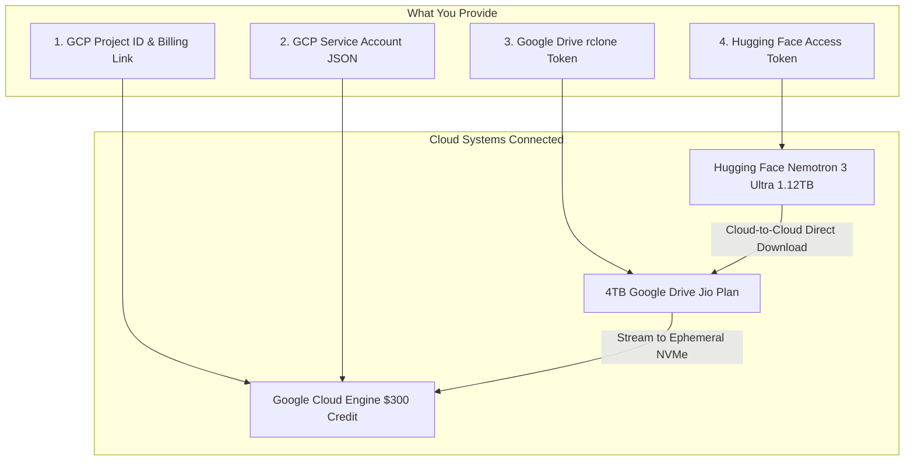
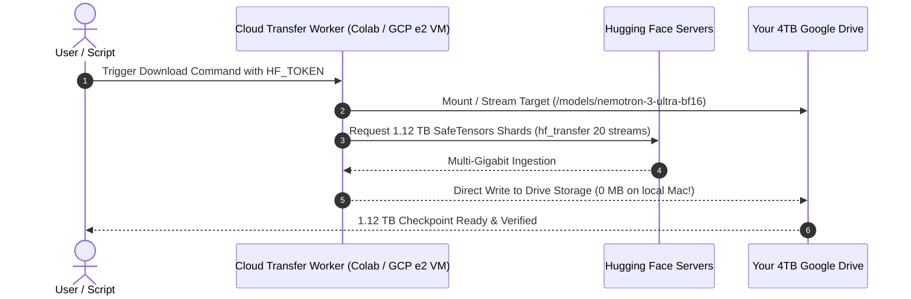
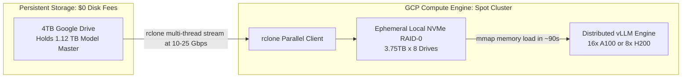

# Connectivity & Direct Model Download Plan: Google Drive & Google Cloud

> **Goal**:  
> 1. Detail **exactly what information and credentials you need to provide** to connect your 4TB Google Drive (Jio Plan) and Google Cloud Platform ($300 Credit).  
> 2. Detail the exact method to **download the 1.12 TB Nemotron 3 Ultra BF16 model directly into Google Drive** in the cloud—**using 0 MB of your local Mac disk space**.

---

## Table of Contents
1. [What You Need to Provide (Credentials & Setup Checklist)](#1-what-you-need-to-provide)
2. [How We Directly Download 1.12 TB into Google Drive (0 Bytes on Mac)](#2-how-we-directly-download-112-tb-into-google-drive)
3. [Connecting Google Engine (GCP) to Google Drive](#3-connecting-google-engine-gcp-to-google-drive)
4. [Step-by-Step Action Roadmap](#4-step-by-step-action-roadmap)

---

## 1. What You Need to Provide

To establish the bridge between Google Drive, Google Cloud (GCP), and Hugging Face, here is the exact checklist of items to gather:



### Checklist Item 1: Hugging Face Access & License (For the Model)
Because Nemotron 3 Ultra is an open-weights model by NVIDIA with an OpenMDW 1.1 license:
1. **Hugging Face Account**: Free account on [huggingface.co](https://huggingface.co).
2. **License Acceptance**: Go to the official model repository page (e.g., `nvidia/Nemotron-3-Ultra` or official checkpoint) and click **"Agree and access repository"**.
3. **Hugging Face Token**:
   - Go to: `Hugging Face -> Settings -> Access Tokens`.
   - Create a token with **Read** permission.
   - *Value needed*: `hf_xxxxxxxxxxxxxxxxxxxxxxxxx`

---

### Checklist Item 2: Google Drive Connectivity (For Your 4TB Jio Plan)
To allow our cloud scripts to write and read from your Google Drive without manual browser clicking:

#### Option A: `rclone` OAuth (Recommended — Quickest & Easiest)
* Run a quick setup command on your terminal (we can generate the exact one-liner).
* It opens your Google browser login once $\rightarrow$ click **Allow** for Google Drive access.
* This generates an authorization token that we store securely in `infra/rclone.conf`.

#### Option B: Google Cloud Service Account with Drive API
1. In [Google Cloud Console](https://console.cloud.google.com), enable the **Google Drive API**.
2. Go to **IAM & Admin $\rightarrow$ Service Accounts $\rightarrow$ Create Service Account**.
3. Create a JSON key (`gdrive-service-account.json`).
4. Share a dedicated folder in your Google Drive (e.g. `Nemotron-Models/`) with the Service Account email address as **Editor**.

---

### Checklist Item 3: Google Cloud Platform (Google Engine) Setup
To use your **$300 Google Cloud Credit** for compute:
1. **GCP Project ID**: The ID of your cloud project (e.g., `nemotron-engine-451203`).
2. **Billing Verification**: Ensure your $300 credit is active in `Billing -> Overview`.
3. **Enabled APIs** (takes 2 minutes in Google Cloud Console):
   - *Compute Engine API* (for GPU/CPU VMs)
   - *Cloud Storage API* (for staging)
   - *IAM Service Account Credentials API*
4. **Compute Engine Service Account Key**:
   - Downloaded JSON credentials file (e.g. `gcp-credentials.json`) with `Compute Admin` and `Service Account User` roles.
5. **GPU Quota Check**:
   - In GCP Console $\rightarrow$ **IAM & Admin $\rightarrow$ Quotas**.
   - Check quota for: `NVIDIA A100 GPUs` or `NVIDIA L4 GPUs` in your preferred region (e.g., `us-central1`, `us-east4`, or `asia-south1`).

---

## 2. How We Directly Download 1.12 TB into Google Drive

> [!CAUTION]
> **Do NOT download the 1.12 TB model to your Mac!**  
> Most Macs only have 256GB, 512GB, or 1TB of local storage. Downloading 1.12 TB over home Wi-Fi would fill your laptop SSD completely, crash your machine, and take 20–30 hours.

Instead, we use **Cloud-to-Cloud Direct Streaming**: the model downloads directly from Hugging Face into your Google Drive through Google's internal datacenter backbone at **multi-gigabit speeds (1–3 Gbps)**.



### Method 1: Google Colab Pro / Free Transfer (Easiest & Free)

Google Colab runs directly inside Google’s datacenter and has a native high-speed pipe to Google Drive.

1. Create a simple notebook or run the following automated script in Google Colab:
```python
# 1. Mount your 4TB Google Drive
from google.colab import drive
drive.mount('/content/drive')

import os

# 2. Enable Hugging Face high-speed multi-threaded transfer
!pip install -q huggingface_hub[hf_transfer]
os.environ["HF_HUB_ENABLE_HF_TRANSFER"] = "1"
os.environ["HF_TOKEN"] = "YOUR_HF_TOKEN_HERE"

# 3. Target folder on your 4TB Google Drive
DESTINATION = "/content/drive/MyDrive/models/nemotron-3-ultra-bf16"
os.makedirs(DESTINATION, exist_ok=True)

# 4. Stream 1.12 TB directly from Hugging Face into Google Drive
from huggingface_hub import snapshot_download

print("Starting direct cloud-to-drive transfer...")
snapshot_download(
    repo_id="nvidia/Nemotron-3-Ultra",  # Official model repo ID
    local_dir=DESTINATION,
    max_workers=16,
    ignore_patterns=["*.msgpack", "*.h5", "*.ot"]  # Only download SafeTensors & configs
)
print("Download complete! Model stored safely in 4TB Google Drive.")
```
* **Speed**: Downloads at **~150–300 MB/s** across Google's internal network.
* **Duration**: 1.12 TB finishes in roughly **1.5 to 2 hours**.
* **Local Mac Impact**: **0 MB downloaded to your laptop**.

---

### Method 2: Headless GCP Transfer VM ($0.15 Total Cost)

If you prefer a completely automated background process without keeping a browser tab open:
1. We spin up a cheap, temporary **standard CPU VM** on GCP (`e2-standard-4`, costs ~$0.13/hour).
2. The VM mounts your Google Drive via `rclone` in the background.
3. It runs `huggingface-cli download` directly into the mounted drive path inside a detached `tmux` session.
4. Once the download finishes, the script automatically **terminates the VM**, costing less than $0.30 from your $300 credit.

---

## 3. Connecting Google Engine (GCP) to Google Drive

Once the 1.12 TB checkpoint is in your Google Drive, how does your GCP GPU cluster access it?



1. **Ephemeral Local NVMe**: High-GPU VMs on GCP (like `a3-highgpu-8g` or `a2-megagpu-16g`) come equipped with **Local NVMe SSDs (up to 30 TB raw space)** at **$0 extra charge** while the VM is running.
2. **Mount Script**: The VM startup script mounts your Google Drive via `rclone` and streams the SafeTensors shards onto the local NVMe disks in ~12 minutes.
3. **Zero Idle Disk Fees**: When your agent finishes its work, the VM is stopped. No expensive 1.2 TB persistent SSD is kept running, preserving your $300 credit.

---

## 4. Step-by-Step Action Roadmap

Here is the exact order of steps we will take:

```
[Phase 1: Credentials & Authorizations]
  1. Generate your Hugging Face Token (Read permissions) & accept NVIDIA license.
  2. Authorize Google Drive via rclone or Service Account.
  3. Verify GCP Project ID and API enablement.
       ↓
[Phase 2: Direct Model Download to Google Drive]
  4. Run the Cloud-to-Drive streaming script (Colab or temporary GCP transfer VM).
  5. Validate all ~224 SafeTensors shards in your 4TB Google Drive.
       ↓
[Phase 3: Automated Connectivity Scripts]
  6. Create `infra/setup_gdrive_rclone.sh` with your Drive authorization.
  7. Create `infra/gcp_cluster_launcher.sh` to spin up Spot instances on GCP.
  8. Test direct streaming from Google Drive to a GCP test instance.
       ↓
[Phase 4: Agent Core Implementation]
  9. Deploy the decoupled FastAPI backend & Next.js frontend!
```

---

### What I Need From You First:
To get started right now, please provide or confirm:
1. Do you have a **Hugging Face Access Token**? (If not, create one at [huggingface.co/settings/tokens](https://huggingface.co/settings/tokens)).
2. Which download method do you prefer for getting the 1.12 TB model into Google Drive?
   - **Method A (Google Colab)**: Simplest, free, 1-click cloud notebook.
   - **Method B (GCP Headless Transfer VM)**: Fully automated script on your GCP project.
3. Your **Google Cloud Project ID** (when you're ready to link GCP).
