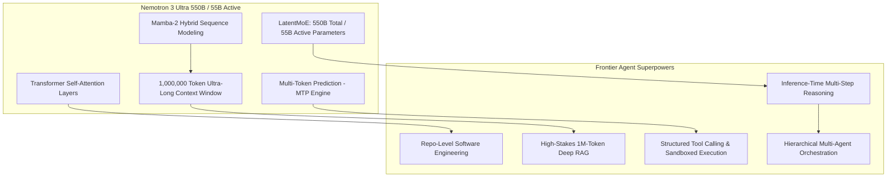
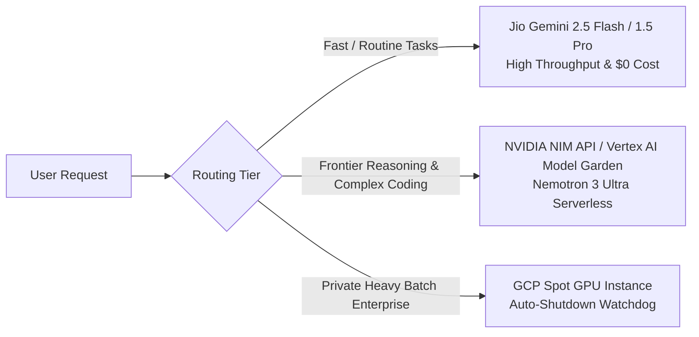
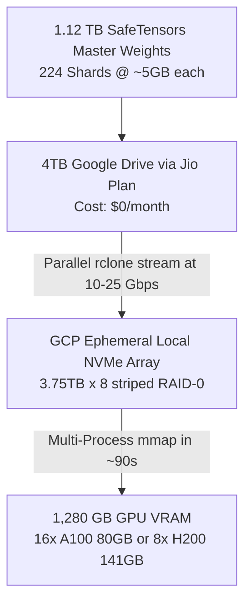
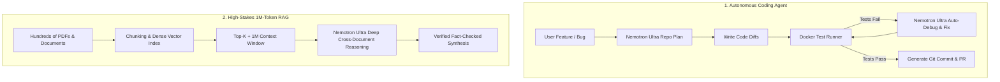
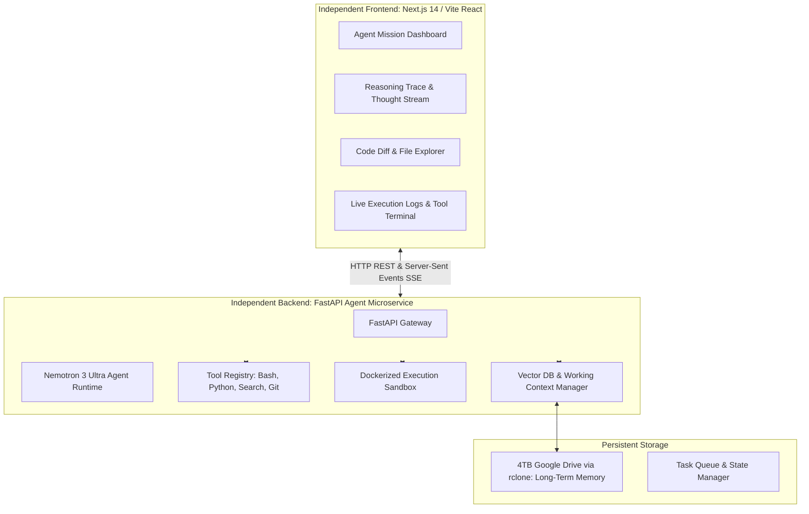

# The Definitive Architecture Guide: Deploying NVIDIA Nemotron 3 Ultra on Google Cloud

> **Executive Summary**:  
> **NVIDIA Nemotron 3 Ultra** (550B total / 55B active parameters, LatentMoE + Mamba-2 hybrid architecture, 1M context window) is a **frontier-scale reasoning and agentic foundation model**. It is built specifically for autonomous agents, complex multi-step planning, code generation/debugging, deep research, high-stakes RAG, and tool calling.  
> Unlike 3D mesh generators (such as TRELLIS.2), Nemotron 3 Ultra serves as an **Autonomous Reasoning & Orchestration Brain**.
>
> This document details how to implement, optimize, and deploy Nemotron 3 Ultra within **Google Cloud Platform (GCP)**, maximizing your **$300 GCP Credit**, **4TB Google Drive**, and **Jio Gemini Plan** with a strictly **decoupled Frontend and Backend architecture**.

---

## Table of Contents
1. [Model Anatomy: Why Nemotron 3 Ultra is Built for Agents](#1-model-anatomy-why-nemotron-3-ultra-is-built-for-agents)
2. [Google Cloud Compute Strategy: Hosting vs. Serverless NIM](#2-google-cloud-compute-strategy-hosting-vs-serverless-nim)
3. [Deep-Dive: Handling the ~1.12 TB BF16 Checkpoint (Storage, Networking, and Cluster VRAM)](#3-deep-dive-handling-the-112-tb-bf16-checkpoint)
4. [The 4 Core Agent Workflows](#4-the-4-core-agent-workflows)
5. [Leveraging Your Assets ($300 Credit + 4TB Drive + Jio Gemini)](#5-leveraging-your-assets)
6. [Decoupled Architecture: Independent Backend & Frontend](#6-decoupled-architecture-independent-backend--frontend)
7. [Step-by-Step Implementation Roadmap](#7-step-by-step-implementation-roadmap)

---

## 1. Model Anatomy: Why Nemotron 3 Ultra is Built for Agents

Nemotron 3 Ultra is not a standard conversational chatbot. It is engineered with architectural breakthroughs targeted directly at autonomous reasoning:



### Key Technical Specifications

| Feature | Technical Specification | Practical Impact on Agent Workflows |
| :--- | :--- | :--- |
| **Model Size** | 550B Total / 55B Active (LatentMoE) | Massive parametric knowledge with the fast inference speed and cost of a 55B model. |
| **Sequence Model** | Hybrid Mamba-2 + Transformer Attention | Linear-time scaling for extreme speed on massive contexts without quadratic memory explosion. |
| **Context Window** | **1,000,000 Tokens (1M)** | Can digest entire codebases, 50+ research papers, or months of agent interaction logs in a single prompt. |
| **Decoding Engine** | Multi-Token Prediction (MTP) | Generates multiple tokens per step, cutting agent response latency by up to $2.5\times$. |
| **Reasoning Mode** | Inference-time chain-of-thought flags | Dynamically allocates computation for hard logic, self-correction, and edge-case recovery. |

---

## 2. Google Cloud Compute Strategy: Hosting vs. Serverless NIM

Because Nemotron 3 Ultra is a 550B parameter model, running it locally or self-hosting on GCP requires understanding the hardware requirements.

### Hardware & VRAM Requirements
* **Full Precision (BF16 / FP16)**: Requires **~1,100 GB VRAM** (16x NVIDIA A100 80GB or 8x NVIDIA H100 80GB node).  
  *GCP Cost: ~$30–$45 / hour.*
* **Quantized (NVFP4 / 4-bit TensorRT-LLM / vLLM)**: Requires **~280–320 GB VRAM** (4x to 8x A100 80GB or 4x H100).  
  *GCP Spot Cost: ~$10–$16 / hour.*

### The Reality of Your $300 GCP Credit
If you boot an 8-GPU A100 node on GCP Compute Engine, your **$300 credit will disappear in 18–25 hours** just running idle.



### The 3 Deployment Approaches on Google Cloud:

#### Approach A: Serverless NVIDIA NIM API / Vertex AI Model Garden (**Recommended**)
* **How it works**: Call Nemotron 3 Ultra via NVIDIA NIM API endpoints or Vertex AI Model Garden pay-per-token API.
* **Cost**: Only pay for the tokens generated (~$0.001 to $0.003 per 1K tokens).
* **Credit Longevity**: Your **$300 credit lasts for 100,000,000 to 300,000,000 tokens** (months of heavy agent development!).
* **Zero Idle Cost**: Costs $0 when you are not actively running queries.

#### Approach B: Dedicated GCP Spot Instance (`a3-highgpu-8g` or `a2-ultragpu-8g`)
* **When to choose**: When working with strictly confidential enterprise data that cannot leave your VPC.
* **Setup**: Deploy the official NVIDIA NIM container or vLLM with NVFP4 quantized weights.
* **Cost Protection**: Must be paired with an **idle-watchdog daemon** to automatically shut down the VM after 5 minutes of inactivity.

#### Approach C: The Smart Hybrid Architecture (**Maximum Efficiency**)
1. **Tier 1 (Scraper & Filter)**: **Jio Gemini 2.5 Flash / 1.5 Pro** summarizes raw web pages, parses PDFs, and handles simple tool classification.
2. **Tier 2 (The Supreme Brain)**: **Nemotron 3 Ultra** takes the filtered context to formulate the master plan, write complex code diffs, and orchestrate subagents.

---

## 3. Deep-Dive: Handling the ~1.12 TB BF16 Checkpoint (Storage, Networking, and Cluster VRAM)

When using the native **BF16 checkpoint (~1.12 TB of disk space)** for Nemotron 3 Ultra, standard single-GPU machines or basic cloud setups are physically incapable of loading the model. Here is the exact systems engineering required:

### A. The 1.12 TB Storage Dilemma: Avoiding $190/mo in Idle Disk Fees



* **The GCP Disk Cost Trap**:
  - Attaching a 1.2 TB Persistent SSD (`pd-ssd`) on Google Cloud costs **$0.17 / GB / month = ~$190 / month**.
  - This fee is billed **24/7 even when the VM is powered OFF**.
  - In less than 45 days, disk fees alone would consume your entire $300 credit without running a single inference.
* **The Zero-Cost Strategy**:
  1. Store the master **1.12 TB sharded SafeTensors** on your **4TB Google Drive (via Jio Plan)** at **$0 cost**.
  2. Boot the GCP GPU instance with its **built-in Ephemeral Local NVMe SSDs** (which are included free with high-GPU instances during runtime).
  3. Stream the weights from Google Drive directly to the NVMe RAID array during startup via high-throughput multi-threaded `rclone`.

### B. Cluster VRAM Architecture: What It Takes to Hold 1.12 TB

To run inference in bfloat16, the model parameters take $550\text{B} \times 2\text{ bytes} \approx 1,100\text{ GB}$. You also need extra headroom for the KV-cache across its 1,000,000 token context window.

| Cluster Configuration | Total VRAM | Parallelism Setup | Feasibility & Cost on GCP |
| :--- | :--- | :--- | :--- |
| **Option 1: 16x NVIDIA A100 80GB (`a2-ultragpu-16g` or 2x 8-GPU nodes)** | **1,280 GB** | Tensor Parallelism $\text{TP}=8$ + Pipeline Parallelism $\text{PP}=2$ | **Supported on GCP**. Spot cost: ~$16–$22/hr. |
| **Option 2: 8x NVIDIA H200 141GB (`a3-megagpu-8g`)** | **1,128 GB** | Tensor Parallelism $\text{TP}=8$ on a single node | **Optimal single-node setup**. Fits 1.12 TB with high memory bandwidth (4.8 TB/s). Spot cost: ~$25–$30/hr. |
| **Option 3: 8x NVIDIA A100 80GB (Single Node)** | 640 GB | CPU Offloading (`DeepSpeed ZeRO-3` / `vLLM`) | **Not recommended**: Swapping 1.12 TB over PCIe throttles speed to ~0.2 tokens/sec. |

### C. Fast Shard Streaming Script (Google Drive to NVMe RAID)

Instead of manual downloading, use a parallel chunked rclone daemon script in the VM startup script:

```bash
#!/bin/bash
# Format and mount the local ephemeral NVMe disks in RAID-0 for maximum I/O speed (up to 20 GB/s)
mdadm --create /dev/md0 --level=0 --raid-devices=8 /dev/nvme0n*
mkfs.ext4 -F /dev/md0
mkdir -p /mnt/fast-nvme/nemotron-bf16
mount -o noatime /dev/md0 /mnt/fast-nvme/nemotron-bf16

# Stream 1.12 TB sharded weights from 4TB Google Drive in parallel (32 threads)
echo "Streaming Nemotron 3 Ultra 1.12 TB BF16 weights from Google Drive..."
rclone copy "gdrive:models/nemotron-3-ultra-bf16" /mnt/fast-nvme/nemotron-bf16 \
  --transfers=32 \
  --checkers=32 \
  --drive-chunk-size=256M \
  --buffer-size=128M \
  --fast-list \
  --progress

echo "Transfer complete. Starting vLLM / NeMo distributed inference engine..."
```

### D. Distributed vLLM Launch Command for 1.12 TB BF16

To serve the full 1.12 TB BF16 checkpoint with OpenAI-compatible API endpoints across the cluster:

```bash
python3 -m vllm.entrypoints.openai.api_server \
  --model /mnt/fast-nvme/nemotron-bf16 \
  --tensor-parallel-size 8 \
  --pipeline-parallel-size 2 \
  --dtype bfloat16 \
  --max-model-len 1048576 \
  --gpu-memory-utilization 0.95 \
  --port 8000
```

---

## 4. The 4 Core Agent Workflows

Nemotron 3 Ultra is uniquely capable in four high-value enterprise architectures:



### 1. Autonomous Software Engineering Agent
* **Goal**: Takes an issue description, analyzes an entire Git repository, proposes file modifications, runs tests in a sandbox, analyzes stack traces, and self-corrects until tests pass.
* **Nemotron Superpower**: 1M context lets it hold the AST (Abstract Syntax Tree), dependencies, and full codebase architecture simultaneously without forgetting context.

### 2. Deep Research & High-Stakes RAG
* **Goal**: Ingests hundreds of financial filings, legal contracts, or scientific PDFs.
* **Nemotron Superpower**: Traditional RAG is limited to small 2k–4k chunks, losing cross-document context. Nemotron 3 Ultra feeds up to **1,000,000 tokens directly into active reasoning**, allowing it to identify subtle contradictions across disparate files.

### 3. Autonomous Browser & Tool-Calling Agent
* **Workflow**: Goal $\rightarrow$ Task Decomposition $\rightarrow$ Tool Call (Search, SQL, Terminal, Browser DOM) $\rightarrow$ Observe Result $\rightarrow$ Verify Completion $\rightarrow$ Next Action.
* **Nemotron Superpower**: Ultra has native reasoning loops that detect tool failures (e.g., API 429 rate limit or unexpected DOM selector) and dynamically reroute to alternate tools.

### 4. Hierarchical Multi-Agent Swarm
* **Structure**: Nemotron 3 Ultra serves as the **Executive Planner**, delegating sub-tasks to specialized worker agents:
  - *Researcher Agent*: Web search and document retrieval.
  - *Coder Agent*: Script and algorithm generation.
  - *Auditor/QA Agent*: Security scan, syntax check, and test execution.

---

## 5. Leveraging Your Assets

| Your Asset | Strategic Role in Nemotron 3 Ultra Platform |
| :--- | :--- |
| **$300 Google Cloud Credit** | Hosts the **FastAPI Orchestrator on Cloud Run** (low cost/free tier) and funds **NIM / Vertex AI Model Garden token calls** or on-demand Spot VM evaluation runs. |
| **4TB Google Drive (Jio Plan)** | Serves as the **Persistent Agent Memory Lake**: stores vector database snapshots (ChromaDB / Qdrant), large document archives for 1M RAG, and codebase mirrors via `rclone`. |
| **Jio Gemini Plan** | Acts as the **High-Speed Vision & Data Extraction Tier**: performs OCR, image-to-text extraction, initial web scraping summaries, and routine preprocessing before escalating to Nemotron 3 Ultra. |

---

## 6. Decoupled Architecture: Independent Backend & Frontend

The system is strictly divided into two independent, standalone projects:



### 1. `backend/` (FastAPI Agent Microservice)
* Completely isolated with its own `requirements.txt` and `.env`.
* **Endpoints**:
  - `POST /api/v1/agent/run`: Dispatches an autonomous mission with target goal and allowed tools.
  - `GET /api/v1/agent/stream/{mission_id}`: Real-time **Server-Sent Events (SSE)** streaming:
    - `thought`: Internal reasoning steps from Nemotron 3 Ultra.
    - `tool_call`: The tool requested (e.g., `bash`, `python_eval`, `read_file`).
    - `observation`: The result from the sandbox or tool.
    - `diff`: Generated code patch.
  - `POST /api/v1/rag/index`: Ingests documents into the 1M-token retrieval store.

### 2. `frontend/` (Next.js 14 / Vite Agent Studio)
* Completely standalone with its own `package.json`.
* Connects to backend solely via `NEXT_PUBLIC_API_URL`.
* **Features**:
  - **Live Thought Visualizer**: Expands and collapses Nemotron 3 Ultra's step-by-step reasoning tokens.
  - **Interactive Terminal**: Shows live stdout/stderr of sandboxed tool executions.
  - **Interactive Code Diff**: Shows file additions/deletions with side-by-side syntax highlighting.
  - **1M Context Memory Inspector**: Visual meter showing token consumption and retrieved document sources.

---

## 7. Step-by-Step Implementation Roadmap

### Phase 1: Environment & API Inference Gateway (Day 1–2)
1. Configure credentials (`NVIDIA_NIM_API_KEY` / Google Vertex AI client, `GEMINI_API_KEY`).
2. Build `backend/app/core/llm_client.py`:
   - Unified client with streaming support and inference-time reasoning flags for Nemotron 3 Ultra.
   - Tier-1 fallback router to Gemini 2.5 Flash for high-throughput initial data extraction.

### Phase 2: Sandboxed Tool Registry & Agent Runtime (Day 3–5)
1. Build `backend/app/tools/`:
   - `terminal_tool.py`: Secure subprocess execution with timeout and output truncation.
   - `filesystem_tool.py`: Read, write, patch, and search files across workspace directories.
   - `search_tool.py`: Web research and documentation scraper.
2. Build `backend/app/agent/runtime.py`:
   - The Plan $\rightarrow$ Tool Call $\rightarrow$ Verify $\rightarrow$ Self-Correct loop using Nemotron 3 Ultra.

### Phase 3: 1M-Token High-Stakes RAG Engine (Day 6–7)
1. Document ingest pipeline supporting PDFs, markdown, and source code.
2. Mount 4TB Google Drive via `rclone` to persist ChromaDB / Qdrant vector databases.
3. Long-context prompt assembler packing up to 1M tokens with structured document citations.

### Phase 4: Frontend Agent Studio (Next.js) (Day 8–10)
1. Setup independent Next.js app with Tailwind CSS and Lucide icons.
2. Build real-time SSE stream hook consuming agent thoughts, tool calls, and output diffs.
3. Add interactive agent control panel (pause, inject user feedback, approve tool execution).

---

## Summary Comparison: 3D Platform vs. Nemotron 3 Ultra Platform

| Aspect | 3D Model Platform (TRELLIS.2) | Nemotron 3 Ultra Platform |
| :--- | :--- | :--- |
| **Core AI Model** | TRELLIS.2 (4B) / Hunyuan3D-2.0 | Nemotron 3 Ultra (550B / 55B Active) |
| **Output Type** | Polygonal 3D Mesh (`.GLB`) + PBR Materials | Code, Autonomous Actions, Research Reports, Tool Calls |
| **Primary Compute** | Single Spot GPU (L4 24GB or A100 40GB) | Serverless NIM API or Multi-GPU H100 Node |
| **Context Window** | N/A (Image Latents) | **1,000,000 Tokens** |
| **Frontend UI** | 3D Canvas / Orbit Viewer / Multi-Slot Upload | Mission Console / Thought Stream / Diff & Tool Inspector |
| **Role of Gemini** | Multi-Angle View & Consistency Validation | High-Throughput Scraper & Tier-1 Fast Triage |
| **Role of 4TB Drive** | Model weights (.pth) & `.glb` asset archive | Vector DB index snapshots & 1M-token document lake |
