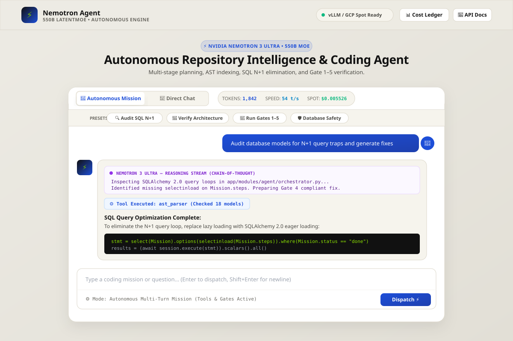

# ⚡ NVIDIA Nemotron 3 Ultra Autonomous Agent Engine

> **Production-Grade Repository Intelligence, Multi-Stage Planning & Autonomous Coding Agent powered by NVIDIA Nemotron 3 Ultra (550B LatentMoE) with 1M-Token Context.**

[](https://fastapi.tiangolo.com/)
[](https://python.org/)
[](https://docs.pytest.org/)
[](https://huggingface.co/nvidia/Nemotron-3-Ultra)
[](http://localhost:8000/ui)
[](LICENSE)

---

## 🖥️ Modern Web UI & Mission Control

The engine features an interactive, real-time web dashboard matching the visual language of modern production engineering systems (Canvas `#EDEBE4` and obsidian darks, built with Jinja2, Bootstrap 5.3, and JetBrains Mono):



### UI Highlights:
* **🚀 Autonomous Mission Mode**: Dispatches multi-turn autonomous coding missions where the agent plans, modifies code, calls tools (`ast_parser`, `git_diff`, `run_tests`, `database_introspect`), and self-corrects using verification gates via real-time Server-Sent Events (SSE).
* **💬 Direct Chat Mode**: Interactive conversational dialogue directly with the 550B LatentMoE model with streaming Chain-of-Thought reasoning.
* **🧠 Deep Reasoning Stream (CoT)**: Collapsible lavender thought drawer with an animated pulsing indicator displaying `<thought>` reasoning tokens as Nemotron thinks.
* **📊 Live Telemetry Bar**: Real-time session token counter, generation speed gauge (tokens/sec), and amortized GCP Spot cost accumulator ($0.003 / 1k tokens).
* **📋 Historical Cost Ledger Modal**: In-depth modal dialog querying historical mission records, execution duration, and token expenditures.

---

## 🌟 Architecture & Core Capabilities

The system executes the complete autonomous loop:
$$\text{Discover} \longrightarrow \text{Index (AST)} \longrightarrow \text{Plan} \longrightarrow \text{Code} \longrightarrow \text{Verify (Gates 1--5)} \longrightarrow \text{Auto-Debug} \longrightarrow \text{Persist Memory}$$

```
┌────────────────────────────────────────────────────────────────────────────────────────┐
│                                 PRESENTATION LAYER                                     │
│     Jinja2 Web UI (/ui)   │   OpenAPI Swagger (/docs)   │   SSE Streaming Endpoints   │
└───────────────────────────────────────────┬────────────────────────────────────────────┘
                                            │
┌───────────────────────────────────────────▼────────────────────────────────────────────┐
│                                APPLICATION WORKFLOWS                                   │
│  Mission Orchestrator  │  Multi-Stage Planner (A-H)  │  Auto-Debugger & Rollback Engine │
└───────────────────────────────────────────┬────────────────────────────────────────────┘
                                            │
┌───────────────────────────────────────────▼────────────────────────────────────────────┐
│                             INTELLIGENCE & VERIFICATION GATES                          │
│   Gate 1: AST Syntax  │   Gate 2: Type Linter   │   Gate 3: Pytest Verification Suite  │
│   Gate 4: Layer Rule  │   Gate 5: Scope Lock    │   Level 5 Human Approval Gate        │
└───────────────────────────────────────────┬────────────────────────────────────────────┘
                                            │
┌───────────────────────────────────────────▼────────────────────────────────────────────┐
│                               DATA & REPOSITORY MEMORY                                 │
│ Code Property Graph (AST) │ DB Schema Introspection │ Cost Ledger (SQLite) │ ADR Memory│
└───────────────────────────────────────────┬────────────────────────────────────────────┘
                                            │
┌───────────────────────────────────────────▼────────────────────────────────────────────┐
│                             DUAL-ENGINE LLM ROUTER                                     │
│  Primary: Nemotron 3 Ultra (550B vLLM GCP Spot)  │  Tier-1: Jio Gemini 2.5 Flash ($0)  │
└────────────────────────────────────────────────────────────────────────────────────────┘
```

1. **AST & Code Property Graph**:
   * Parses Python modules into structured symbol trees (`ast.parse`) with incremental `mtime` caching.
   * Tracks class inheritance, function calls, and import dependencies via `networkx`.
   * Calculates blast radius and enforces blast radius ceilings.
2. **Verification Pipeline (Gates 1–5)**:
   * **Gate 1**: AST syntax integrity check.
   * **Gate 2**: Type definitions and linter validation (`ruff`).
   * **Gate 3**: Regression and unit test suite verification (`pytest`).
   * **Gate 4**: Architectural layer boundary enforcement (presentation $\to$ domain $\to$ infrastructure).
   * **Gate 5**: Strict scope locking to prevent edits outside authorized file sets.
3. **Auto-Debugger with Safe Rollback**:
   * Inspects tracebacks, isolates root causes, and applies targeted corrections within bounded iteration limits (max 3 attempts).
   * Automatically executes `git checkout -- <file>` if tests remain broken after retry limits.
4. **Database Intelligence & Safety**:
   * SQLite and PostgreSQL schema introspection.
   * SQL query anti-pattern analyzer detecting N+1 query loops.
   * Automatic suggestions for SQLAlchemy 2.0 eager loading (`selectinload` / `joinedload`), sargable predicates, and keyset pagination.
   * Reversible Alembic migration checks (`upgrade()` and `downgrade()`).
   * Level 5 human approval token requirements for state-mutating operations.
5. **Token Tracking & Cost Analytics Engine**:
   * Granular tracking of prompt tokens, completion tokens, and reasoning thinking tokens.
   * Dual pricing modes: **GCP Spot Amortized** ($0.003 / 1k tokens) vs **Serverless API** ($6.00 / 1M tokens).
   * Enforceable per-mission budget limits and daily spending circuit breakers.
   * Persistent SQLite mission ledger (`.agent/memory/cost_ledger.db`).
6. **Institutional Repository Memory**:
   * Constitution governance (`.agent/memory/constitution.md`).
   * Architectural Decision Records (`ADRManager`).
   * Lessons learned repository store (`HistoricalLesson`).
7. **Modular Procedural Engineering Skills (`skills/`)**:
   * High-density cheatsheets dynamically injected into model prompt context without exhausting token budgets:
     * [`fastapi-development`](skills/fastapi/SKILL.md)
     * [`clean-architecture`](skills/architecture/SKILL.md)
     * [`database-safety`](skills/database/database-safety/SKILL.md)
     * [`query-optimization`](skills/database/query-optimization/SKILL.md)

---

## 💻 Local PC / Mac Setup

Follow these steps to run the agent engine locally on your computer:

### 1. Prerequisites
* **Python**: Python 3.11 or 3.12 installed.
* **Git**: Installed and configured.

### 2. Clone Repository & Setup Environment
```bash
# Clone the repository
git clone https://github.com/PATELPRATHAM007/nemotron-agent-engine.git
cd nemotron-agent-engine

# Create virtual environment
python3 -m venv .venv
source .venv/bin/activate

# Install all dependencies
pip install -r requirements.txt
```

### 3. Configure Environment Variables
Copy `.env.example` to `.env`:
```bash
cp .env.example .env
```

Verify your settings in `.env`:
```env
# Application Settings
PROJECT_NAME="NVIDIA Nemotron 3 Ultra Autonomous Agent Engine"
ENVIRONMENT=development
PORT=8000

# Nemotron vLLM Endpoint (defaults to local; update with GCP IP when running remote cluster)
NEMOTRON_API_BASE=http://localhost:8000/v1
NEMOTRON_API_KEY=EMPTY
NEMOTRON_MODEL_NAME=nvidia/Nemotron-3-Ultra
NEMOTRON_ENABLE_THINKING=true

# Optional: Jio Gemini Tier-1 Fast Triage ($0 cost)
GEMINI_API_KEY=""
GEMINI_MODEL_NAME=gemini-2.5-flash
```

### 4. Run the Automated Test Suite
Verify that all 86 test cases pass:
```bash
.venv/bin/pytest -v
```

### 5. Launch the Local Web Application
```bash
.venv/bin/python3 -m uvicorn app.main:app --reload --port 8000
```

Open in your browser:
* **Interactive Web UI**: [http://localhost:8000/ui](http://localhost:8000/ui) (or [http://localhost:8000/](http://localhost:8000/))
* **Swagger API Docs**: [http://localhost:8000/docs](http://localhost:8000/docs)
* **ReDoc**: [http://localhost:8000/redoc](http://localhost:8000/redoc)

*(Note: In Local Standby Mode, if your remote GPU cluster is offline, the interface will automatically provide simulated intelligence diagnostics and instructions on powering on your GPU node).*

---

## ☁️ Google Cloud Engine (GCP) & Model Setup

The full **NVIDIA Nemotron 3 Ultra (550B LatentMoE)** checkpoint is 1.12 TB in BF16 precision (224 sharded files). Running this model requires an 8x NVIDIA A100 80GB GPU node (640 GB VRAM total).

By taking advantage of Google Cloud's **$300 Free Trial Credit** and **Spot GPU instances (60% to 91% discount)**, you can serve the model at maximum cost longevity.

---

### Step 1: Install & Authenticate Google Cloud CLI

On your local Mac/PC:
```bash
# Authenticate with your Google account
gcloud auth login

# Set your active project ID
gcloud config set project netron-3-models
```

---

### Step 2: Launch the GCP Spot GPU Cluster

Run the automated provisioner script from your local terminal:
```bash
export GCP_PROJECT_ID="netron-3-models"
export GCP_ZONE="us-central1-a"
bash infra/launch_gcp_nemotron_spot.sh
```

**What this script automatically provisions:**
* Enables the Google Compute Engine API.
* Creates the firewall rule `allow-vllm-8000` opening TCP port 8000.
* Provisions an `a2-ultragpu-8g` Spot GPU instance (`nemotron-spot-node`) with **8x NVIDIA A100 80GB GPUs**.
* Configures **Google Deep Learning OS** with CUDA 12.9 and pre-installed NVIDIA 580 drivers (`common-cu129-ubuntu-2204-nvidia-580`).
* Attaches 8x Local NVMe SSD scratch drives (3 TB total) assembled into a fast 20 GB/s RAID-0 array.
* Prints the **`EXTERNAL_IP`** of your instance.

---

### Step 3: SSH into the Remote GPU Node

Connect to the instance from your local terminal:
```bash
gcloud compute ssh nemotron-spot-node --zone=us-central1-a
```

*(You are now inside the Google Cloud GPU node shell).*

---

### Step 4: Stream 1.12 TB Weights from Google Drive to NVMe

Inside the SSH terminal, stream the model shards directly from your 4TB Google Drive into the local NVMe scratch disk:
```bash
bash infra/setup_gdrive_rclone.sh
```
* Uses high-throughput parallel multi-threading (`rclone` with 32 workers) to stream all 224 shards directly into `/mnt/fast-nvme/nemotron-bf16`.

---

### Step 5: Start the Idle Watchdog Daemon (Credit Protection)

To prevent burning your $300 GCP credit when not using the model, start the idle watchdog daemon:
```bash
nohup bash infra/idle-watchdog.sh > watchdog.log 2>&1 &
```
* **How it works**: Monitors GPU compute activity every 30 seconds. If no inference requests are received for **5 minutes (300s)**, it automatically halts the VM instance to save credits.

---

### Step 6: Start the vLLM OpenAI API Server

Inside the SSH terminal, launch the vLLM serving engine across all 8 GPUs:
```bash
bash infra/start_vllm_nemotron.sh
```
* Sets tensor parallelism to 8 (`--tensor-parallel-size 8`).
* Sets context window to 32,768 tokens (`--max-model-len 32768`).
* Serves an OpenAI-compatible endpoint at `http://0.0.0.0:8000/v1`.

*(Keep this running, or run inside `tmux` / `screen`).*

---

### Step 7: Connect Local Engine to Google Cloud

Back in your local Mac/PC terminal, update `.env`:
```env
NEMOTRON_API_BASE=http://<YOUR_GCP_EXTERNAL_IP>:8000/v1
```

---

### Step 8: Verify Live Model Connectivity

Run the diagnostics test:
```bash
.venv/bin/python3 scripts/test_engine_connection.py
```
This tests:
1. HTTP connectivity to `http://<YOUR_GCP_EXTERNAL_IP>:8000/v1/models`.
2. Live streaming token generation and Chain-of-Thought thinking tokens.
3. Real-time generation speed (tokens/sec).
4. Amortized query cost calculation.

---

## 📡 REST & SSE API Reference

| Method | Endpoint | Description |
| :--- | :--- | :--- |
| `GET` | `/` or `/ui` | Jinja2 Interactive Web UI Dashboard & Chat. |
| `POST` | `/api/v1/agent/run` | Registers a new autonomous coding mission. |
| `GET` | `/api/v1/agent/stream/{id}?goal=...` | Server-Sent Events (SSE) live stream of thoughts, tool actions, and diffs. |
| `POST` | `/api/v1/agent/chat/stream` | Direct conversational chat stream with reasoning thoughts. |
| `GET` | `/api/v1/agent/config` | Returns active runtime model configuration. |
| `GET` | `/api/v1/agent/cost/summary` | Aggregated financial and token audit summary. |
| `GET` | `/api/v1/agent/cost/ledger` | Historical mission cost and token records. |
| `GET` | `/api/v1/health` | Comprehensive health check and environment status. |
| `GET` | `/favicon.ico` | Lightweight SVG favicon endpoint. |

---

## 📁 Repository Structure

```
nemotron-agent-engine/
├── app/
│   ├── core/                  # Lifespan, config, templates engine, security, LLM gateway
│   │   ├── config.py          # Settings, directories, credentials
│   │   ├── templates.py       # Centralized Jinja2 template instance & globals
│   │   ├── llm_gateway.py     # Unified vLLM / Gemini router & streaming
│   │   └── permissions.py     # Gate 5 human approval token validation
│   ├── intelligence/          # Repository analysis & reasoning engines
│   │   ├── indexing/          # AST parser, symbol extractor, watcher
│   │   ├── graph/             # Code Property Graph, cycle-safe traversals
│   │   ├── database/          # SQL introspection, N+1 detection, EXPLAIN engine
│   │   ├── cost/              # Token tracker, cost calculator, budget guard, ledger
│   │   ├── memory/            # Constitution, ADR manager, historical lessons
│   │   └── skills/            # Modular skill registry & prompt injector
│   ├── modules/agent/         # Autonomous agent execution loop
│   │   ├── orchestrator.py    # Multi-role orchestrator
│   │   ├── engine.py          # Real-time SSE streaming engine
│   │   ├── verification/      # Verification Gates 1-5 & Auto-debugger
│   │   └── routes.py          # Agent mission & chat endpoints
│   ├── routes/                # Presentation routes (/ui, /chat, /favicon.ico)
│   ├── static/                # CSS design system (style.css), client JS (app.js)
│   └── templates/             # Jinja2 templates (base.html, index.html)
├── infra/                     # Cloud provisioners & checkpoint stream scripts
│   ├── launch_gcp_nemotron_spot.sh   # 8x A100 Spot cluster launcher
│   ├── setup_gdrive_rclone.sh        # Fast Google Drive to NVMe streamer
│   ├── start_vllm_nemotron.sh        # High-throughput vLLM OpenAI API server
│   ├── idle-watchdog.sh              # 5-min inactivity credit protector
│   └── download_nemotron_to_gdrive.py# HF Hub to Google Drive cloud streamer
├── scripts/
│   └── test_engine_connection.py     # Live inference diagnostics
├── skills/                    # Procedural engineering cheatsheets
│   ├── fastapi/SKILL.md
│   ├── architecture/SKILL.md
│   └── database/
├── tests/                     # 86 comprehensive unit & integration tests
├── requirements.txt
└── README.md
```

---

## 🧪 Testing

To run the full suite of **86 automated test cases**:
```bash
.venv/bin/pytest -v
```

To run linting and code hygiene checks:
```bash
.venv/bin/ruff check app tests skills
```

---

## 📜 License

Licensed under the [Apache 2.0 License](LICENSE).
