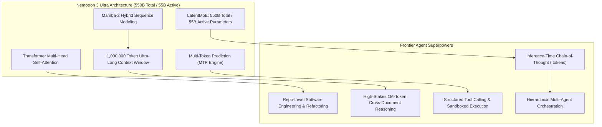
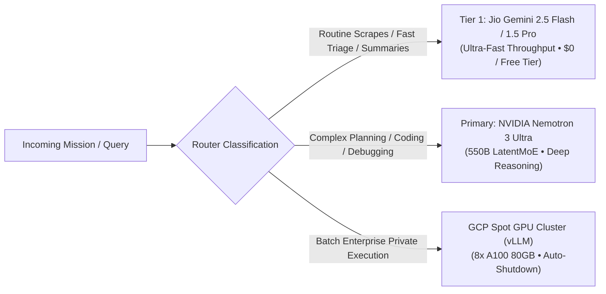
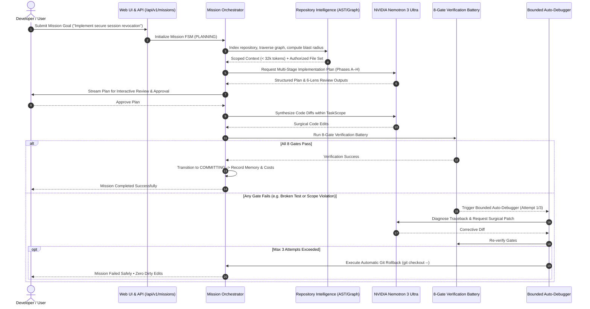
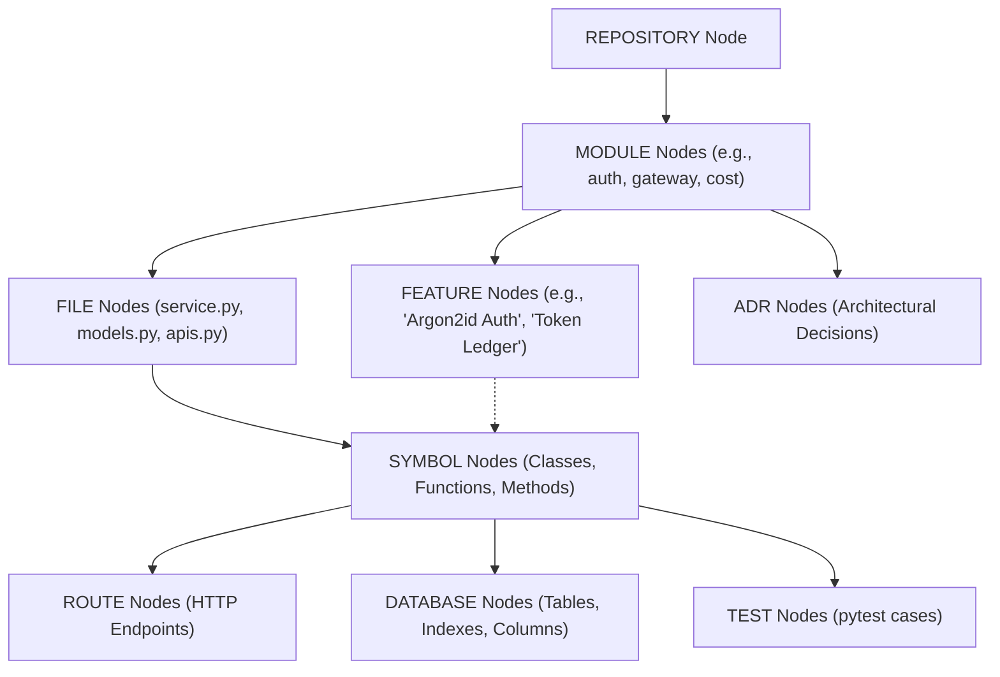
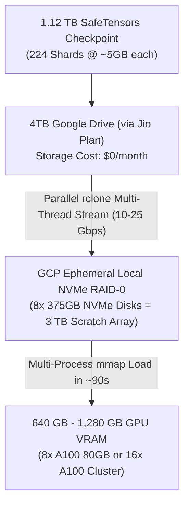
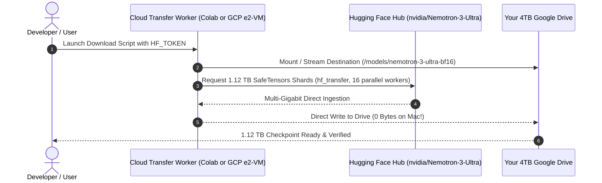

# ⚡ NVIDIA Nemotron 3 Ultra Autonomous Agent Engine

> **Production-Grade Repository Intelligence, Multi-Stage Planning, Verification Guardrails & Autonomous Coding Agent powered by NVIDIA Nemotron 3 Ultra (550B LatentMoE) with 1M-Token Context Window.**

[](https://fastapi.tiangolo.com/)
[](https://python.org/)
[](https://docs.pytest.org/)
[](https://huggingface.co/nvidia/Nemotron-3-Ultra)
[](http://localhost:8000/ui)
[](app/modules/)
[](LICENSE)

---

## 📑 Table of Contents

1. [System Overview & Core Philosophy](#-system-overview--core-philosophy)
   - [The Fatal Flaw of Naive Coding Agents](#the-fatal-flaw-of-naive-coding-agents)
   - [The Repository Intelligence Paradigm](#the-repository-intelligence-paradigm)
   - [Source-of-Truth Hierarchy](#source-of-truth-hierarchy)
2. [Model Anatomy: NVIDIA Nemotron 3 Ultra](#-model-anatomy-nvidia-nemotron-3-ultra)
   - [Why Nemotron 3 Ultra is Built for Agents](#why-nemotron-3-ultra-is-built-for-agents)
   - [Technical Specifications & Architecture](#technical-specifications--architecture)
   - [Multi-Tier Dual-Engine Routing](#multi-tier-dual-engine-routing)
3. [End-to-End System Topology](#-end-to-end-system-topology)
   - [High-Level Architectural Diagram](#high-level-architectural-diagram)
   - [The Autonomous Mission Lifecycle](#the-autonomous-mission-lifecycle)
4. [Deep-Dive: Core Subsystems](#-deep-dive-core-subsystems)
   - [Subsystem 1: Deterministic AST & Invariant Code Fingerprinting](#subsystem-1-deterministic-ast--invariant-code-fingerprinting)
   - [Subsystem 2: Multi-Layer Repository Knowledge Graph & Feature Mapping](#subsystem-2-multi-layer-repository-knowledge-graph--feature-mapping)
   - [Subsystem 3: Change Impact Analysis & Task Scope Lock](#subsystem-3-change-impact-analysis--task-scope-lock)
   - [Subsystem 4: Context Budget Manager & Progressive Hierarchical Expansion](#subsystem-4-context-budget-manager--progressive-hierarchical-expansion)
   - [Subsystem 5: Multi-Stage Planning (Phases A–H) & 6-Review Loop Engine](#subsystem-5-multi-stage-planning-phases-ah--6-review-loop-engine)
   - [Subsystem 6: 8-Gate Verification Battery & Bounded Auto-Debugger](#subsystem-6-8-gate-verification-battery--bounded-auto-debugger)
   - [Subsystem 7: Database Intelligence, Performance & Safety Engine](#subsystem-7-database-intelligence-performance--safety-engine)
   - [Subsystem 8: 7-Level Permission Architecture & Human Approval Gates](#subsystem-8-7-level-permission-architecture--human-approval-gates)
   - [Subsystem 9: Real-Time Token Tracking & Financial Cost Ledger](#subsystem-9-real-time-token-tracking--financial-cost-ledger)
   - [Subsystem 10: Institutional Memory, Constitution & Modular Skills](#subsystem-10-institutional-memory-constitution--modular-skills)
   - [Subsystem 11: Enterprise Security, RBAC/ABAC Policy Engine & Secret Redaction](#subsystem-11-enterprise-security-rbacabac-policy-engine--secret-redaction)
5. [Cloud Infrastructure, Weights Streaming & Zero-Disk-Fee Strategy](#-cloud-infrastructure-weights-streaming--zero-disk-fee-strategy)
   - [The 1.12 TB Storage Challenge: Avoiding $190/mo in Idle Disk Fees](#the-112-tb-storage-challenge-avoiding-190mo-in-idle-disk-fees)
   - [Downloading 1.12 TB Checkpoint with 0 MB on Mac Disk](#downloading-112-tb-checkpoint-with-0-mb-on-mac-disk)
   - [Google Cloud Spot GPU Cluster (8x A100 80GB)](#google-cloud-spot-gpu-cluster-8x-a100-80gb)
   - [Streaming Weights to Ephemeral NVMe RAID-0 (20 GB/s)](#streaming-weights-to-ephemeral-nvme-raid-0-20-gbs)
   - [vLLM Distributed Serving Configuration](#vllm-distributed-serving-configuration)
   - [5-Minute Inactivity Watchdog Daemon (Credit Protection)](#5-minute-inactivity-watchdog-daemon-credit-protection)
6. [Clean Modular Project Structure](#-clean-modular-project-structure)
7. [User & Developer Getting Started Guide](#-user--developer-getting-started-guide)
   - [Local Installation & Setup](#local-installation--setup)
   - [Running the 115-Test Battery](#running-the-115-test-battery)
   - [Launching the Web Application & UI Walkthrough](#launching-the-web-application--ui-walkthrough)
   - [Deploying the Remote GCP GPU Node](#deploying-the-remote-gcp-gpu-node)
8. [API & Server-Sent Events (SSE) Reference](#-api--server-sent-events-sse-reference)
9. [Troubleshooting & Error Resolution](#-troubleshooting--error-resolution)

---

## 🌟 System Overview & Core Philosophy

### The Fatal Flaw of Naive Coding Agents
Most LLM coding assistants operate on a fundamentally flawed premise: dumping hundreds of raw files, arbitrary text snippets, or large vector search chunks ($50\text{k}\text{--}200\text{k}+$ tokens) into a prompt window. In enterprise codebases, this approach inevitably suffers from:
1. **Context Rot & Attentional Degradation**: Critical instructions, business rules, and constraints drown under mountains of boilerplate code.
2. **Exponential Latency & Token Burn**: Ingesting $100\text{k}+$ tokens per turn costs dollars and creates response delays exceeding 60–90 seconds per step.
3. **Unconstrained Wandering & Regressions**: Without an explicit containment barrier, the LLM hallucinates dependencies, modifies unrelated modules, breaks public API contracts, and causes regressions across the repository.

### The Repository Intelligence Paradigm
This engine enforces a strict architectural boundary: **Deterministic tools establish deterministic facts; NVIDIA Nemotron 3 Ultra provides frontier reasoning, planning, code synthesis, and diagnosis.**

$$\text{User Request} \xrightarrow{\text{Identify}} \text{Feature Node} \xrightarrow{\text{Traverse}} \text{Scoped Subgraph} \xrightarrow{\text{Lock}} \text{Task Scope} \xrightarrow{\text{Reason}} \text{Nemotron 3 Ultra} \xrightarrow{\text{Verify}} \text{8 Gates}$$

```
Deterministic Tooling (AST, Symbol Index, Graph, DB Reflection, Linters, Test Runners)
                                    │
                                    ▼
       High-Signal, Compact Structural Context (Strictly <= 32k Tokens)
                                    │
                                    ▼
       NVIDIA Nemotron 3 Ultra (Multi-Step Reasoning, Planning, Coding, Diagnosis)
                                    │
                                    ▼
8-Gate Verification Battery & Guardrails (Syntax, Imports, Types, Scope, Tests, DB Safety)
                                    │
                                    ▼
               Autonomous Healing or Automatic Git Rollback
```

### Source-of-Truth Hierarchy
When resolving conflicts, the engine adheres to an inviolable priority hierarchy:

```
1. Actual Current Source Code & ASTs (Absolute Truth)
                    ↓
2. Test Suite Executions & Assertions (Behavioral Truth)
                    ↓
3. Live Database Schema Introspection & Reflection (Data Truth)
                    ↓
4. Explicit Project Rules & Accepted ADRs (Intentional Truth)
                    ↓
5. Verified Repository Memory & Lessons (Historical Truth)
                    ↓
6. Generated Summaries & Heuristics (Heuristic Truth)
                    ↓
7. Model Speculation / Hallucination (Zero Authority - Blocked)
```

---

## 🧠 Model Anatomy: NVIDIA Nemotron 3 Ultra

### Why Nemotron 3 Ultra is Built for Agents
NVIDIA Nemotron 3 Ultra is an open-weights foundation model explicitly engineered for autonomous software engineering, complex multi-step reasoning, and tool-augmented workflows:


```mermaid
graph TD
    subgraph Architecture ["Nemotron 3 Ultra Architecture (550B Total / 55B Active)"]
        MoE["LatentMoE: 550B Total / 55B Active Parameters"]
        Mamba["Mamba-2 Hybrid Sequence Modeling"]
        Attention["Transformer Multi-Head Self-Attention"]
        MTP["Multi-Token Prediction (MTP Engine)"]
        Context["1,000,000 Token Ultra-Long Context Window"]
    end

    subgraph AgentCapabilities ["Frontier Agent Superpowers"]
        Reasoning["Inference-Time Chain-of-Thought (<thought> tokens)"]
        Coding["Repo-Level Software Engineering & Refactoring"]
        RAG["High-Stakes 1M-Token Cross-Document Reasoning"]
        ToolCalling["Structured Tool Calling & Sandboxed Execution"]
        MultiAgent["Hierarchical Multi-Agent Orchestration"]
    end

    MoE --> Reasoning
    Mamba --> Context
    Attention --> Coding
    MTP --> ToolCalling
    Context --> RAG
    Reasoning --> MultiAgent
```

### Technical Specifications & Architecture

| Feature | Specification | Practical Impact on Agent Engineering |
| :--- | :--- | :--- |
| **Model Size** | **550B Total / 55B Active (LatentMoE)** | Unlocks the vast parametric knowledge of a 550B model while operating at the latency and cost footprint of a 55B model. |
| **Sequence Model** | **Hybrid Mamba-2 + Transformer Attention** | Delivers linear-time scaling across massive contexts, eliminating quadratic memory explosion during deep repository indexing. |
| **Context Window** | **1,000,000 Tokens (1M)** | Allows digesting entire repositories, dozens of technical specifications, and extensive mission logs without truncation. |
| **Decoding Engine** | **Multi-Token Prediction (MTP)** | Generates multiple tokens per forward pass, cutting agent execution latency by up to $2.5\times$. |
| **Reasoning Mode** | **Native `<thought>` Reasoning Stream** | Dynamically scales computation during planning, complex debugging, and edge-case evaluation. |
| **Checkpoint Size** | **1.12 TB (BF16 / FP16)** | Sharded across 224 SafeTensors files, serving 8x A100 80GB or 8x H200 141GB clusters. |

### Multi-Tier Dual-Engine Routing
To optimize cost and latency, the system utilizes a multi-tier routing architecture:


```mermaid
flowchart LR
    A["Incoming Mission / Query"] --> B{"Router Classification"}
    B -->|"Routine Scrapes / Fast Triage / Summaries"| C["Tier 1: Jio Gemini 2.5 Flash / 1.5 Pro<br>(Ultra-Fast Throughput • $0 / Free Tier)"]
    B -->|"Complex Planning / Coding / Debugging"| D["Primary: NVIDIA Nemotron 3 Ultra<br>(550B LatentMoE • Deep Reasoning)"]
    B -->|"Batch Enterprise Private Execution"| E["GCP Spot GPU Cluster (vLLM)<br>(8x A100 80GB • Auto-Shutdown)"]
```

---

## 🏛️ End-to-End System Topology

### High-Level Architectural Diagram

```
┌────────────────────────────────────────────────────────────────────────────────────────────────────────┐
│                                       PRESENTATION & API LAYER                                         │
│   Jinja2 Web Dashboard (/ui)    │    OpenAPI Docs (/docs)    │    Server-Sent Events (SSE) Stream      │
└───────────────────────────────────────────────────┬────────────────────────────────────────────────────┘
                                                    │
┌───────────────────────────────────────────────────▼────────────────────────────────────────────────────┐
│                                     DOMAIN MODULES (app/modules/)                                      │
│  ┌──────────────────────┐  ┌──────────────────────┐  ┌──────────────────────┐  ┌────────────────────┐  │
│  │     agent/           │  │      auth/           │  │    constitution/     │  │      cost/         │  │
│  │ Orchestrator, FSM,   │  │ Argon2id, JWT, RBAC, │  │ Standards, Rules,    │  │ Pricing, Ledger,   │  │
│  │ Planning, Auto-Debug │  │ KMS, SSRF, Auditing  │  │ ADR Scaffolding      │  │ Budget Guard       │  │
│  └──────────────────────┘  └──────────────────────┘  └──────────────────────┘  └────────────────────┘  │
│  ┌──────────────────────┐  ┌──────────────────────┐  ┌──────────────────────┐  ┌────────────────────┐  │
│  │    gateway/          │  │   intelligence/      │  │    missions/         │  │    security/       │  │
│  │ Model Registry, vLLM │  │ AST, Graph, Context, │  │ Mission FSM, State,  │  │ Compatibility      │  │
│  │ Adapters, Router     │  │ Impact, DB, Memory   │  │ Multimodal Storage   │  │ Forwarding Layer   │  │
│  └──────────────────────┘  └──────────────────────┘  └──────────────────────┘  └────────────────────┘  │
└───────────────────────────────────────────────────┬────────────────────────────────────────────────────┘
                                                    │
┌───────────────────────────────────────────────────▼────────────────────────────────────────────────────┐
│                                8-GATE VERIFICATION & GUARDRAIL BATTERY                                 │
│   Gate 1: AST Syntax Check       Gate 2: Import Graph        Gate 3: Type Signature & Linter           │
│   Gate 4: Architecture Boundary  Gate 5: Task Scope Lock     Gate 6: Unit Test Execution               │
│   Gate 7: Full Regression Suite  Gate 8: Lint Cleanliness    Level 5: Human DB Mutation Gate           │
└───────────────────────────────────────────────────┬────────────────────────────────────────────────────┘
                                                    │
┌───────────────────────────────────────────────────▼────────────────────────────────────────────────────┐
│                                    STORAGE & REPOSITORY MEMORY                                         │
│   Code Property Graph (AST)  │  SQL Database (SQLite / PG)  │  Cost Ledger  │  ADR & Lesson Store      │
└────────────────────────────────────────────────────────────────────────────────────────────────────────┘
```

### The Autonomous Mission Lifecycle


```mermaid
sequenceDiagram
    autonumber
    actor Dev as Developer / User
    participant WebUI as Web UI & API (/api/v1/missions)
    participant Orch as Mission Orchestrator
    participant Intel as Repository Intelligence (AST/Graph)
    participant Model as NVIDIA Nemotron 3 Ultra
    participant Gates as 8-Gate Verification Battery
    participant AutoFix as Bounded Auto-Debugger

    Dev->>WebUI: Submit Mission Goal ("Implement secure session revocation")
    WebUI->>Orch: Initialize Mission FSM (PLANNING)
    Orch->>Intel: Index repository, traverse graph, compute blast radius
    Intel-->>Orch: Scoped Context (< 32k tokens) + Authorized File Set
    Orch->>Model: Request Multi-Stage Implementation Plan (Phases A–H)
    Model-->>Orch: Structured Plan & 6-Lens Review Outputs
    Orch->>Dev: Stream Plan for Interactive Review & Approval
    Dev-->>Orch: Approve Plan
    Orch->>Model: Synthesize Code Diffs within TaskScope
    Model-->>Orch: Surgical Code Edits
    Orch->>Gates: Run 8-Gate Verification Battery
    alt All 8 Gates Pass
        Gates-->>Orch: Verification Success
        Orch->>Orch: Transition to COMMITTING -> Record Memory & Costs
        Orch-->>Dev: Mission Completed Successfully
    else Any Gate Fails (e.g. Broken Test or Scope Violation)
        Gates-->>AutoFix: Trigger Bounded Auto-Debugger (Attempt 1/3)
        AutoFix->>Model: Diagnose Traceback & Request Surgical Patch
        Model-->>AutoFix: Corrective Diff
        AutoFix->>Gates: Re-verify Gates
        opt Max 3 Attempts Exceeded
            AutoFix->>Orch: Execute Automatic Git Rollback (git checkout --)
            Orch-->>Dev: Mission Failed Safely • Zero Dirty Edits
        end
    end
```

---

## 🔬 Deep-Dive: Core Subsystems

### Subsystem 1: Deterministic AST & Invariant Code Fingerprinting
*Located in [app/modules/intelligence/indexing/](file:///Users/mac/Desktop/nemotron-agent-engine/app/modules/intelligence/indexing/)*

The indexing subsystem parses Python source trees into structured symbols without invoking LLMs.
* **Three-Tier Invariant Fingerprinting**:
  - `file_hash`: SHA-256 of raw bytes on disk.
  - `ast_hash`: SHA-256 computed exclusively over normalized AST node structures. Formatting adjustments, comment edits, and blank lines yield **identical AST hashes**, preventing unnecessary cache invalidation.
  - `symbol_hash`: SHA-256 computed across public class definitions, method signatures, return type annotations, and exported module members.
* **Symbol Catalog**: Provides $O(1)$ lookup for classes, methods, docstrings, decorators, and function signatures.
* **Import Resolver**: Resolves relative imports (`from .service import ...`), absolute package paths, and classifies internal dependencies versus third-party packages.

### Subsystem 2: Multi-Layer Repository Knowledge Graph & Feature Mapping
*Located in [app/modules/intelligence/graph/](file:///Users/mac/Desktop/nemotron-agent-engine/app/modules/intelligence/graph/)*

Maintains an in-memory directed multi-layer graph (`networkx`) mapping business capabilities directly to lines of code:


```mermaid
graph TD
    Repo["REPOSITORY Node"] --> Mod["MODULE Nodes (e.g., auth, gateway, cost)"]
    Mod --> File["FILE Nodes (service.py, models.py, apis.py)"]
    File --> Sym["SYMBOL Nodes (Classes, Functions, Methods)"]
    Sym --> Route["ROUTE Nodes (HTTP Endpoints)"]
    Sym --> DB["DATABASE Nodes (Tables, Indexes, Columns)"]
    Mod --> Feat["FEATURE Nodes (e.g., 'Argon2id Auth', 'Token Ledger')"]
    Feat -.-> Sym
    Sym --> Test["TEST Nodes (pytest cases)"]
    Mod --> ADR["ADR Nodes (Architectural Decisions)"]
```

* **8 Node Kinds**: `REPOSITORY`, `MODULE`, `FILE`, `SYMBOL`, `FEATURE`, `TEST`, `ADR`, `BUG`.
* **11 Edge Kinds**: `CONTAINS`, `IMPORTS`, `CALLS`, `INHERITS`, `IMPLEMENTS`, `TESTS`, `DEFINES_ROUTE`, `ACCESSES_DB`, `MODIFIES`, `DOCUMENTS`, `FIXES`.
* **Cycle-Safe Traversals**: All depth-first and breadth-first search algorithms enforce visited node tracking, preventing infinite recursion on circular dependencies.

### Subsystem 3: Change Impact Analysis & Task Scope Lock
*Located in [app/modules/intelligence/impact/](file:///Users/mac/Desktop/nemotron-agent-engine/app/modules/intelligence/impact/)*

* **Blast Radius Calculation**: When modifying a symbol or file, `ImpactAnalyzer` traverses incoming and outgoing call graphs to compute:
  - Direct dependents (immediate callers).
  - Transitive dependents (upstream services and API controllers).
  - Impacted test suites that must run to verify changes.
* **Task Scope Lock (`TaskScope`)**: Enforces an architectural barrier around file modifications:
  ```python
  # Hard architectural boundary: throws ScopeViolationError if an edit attempts
  # to touch files outside the authorized task boundaries.
  task_scope.validate_path("app/modules/auth/service.py")  # Allowed
  task_scope.validate_path("app/modules/gateway/router.py") # Raises ScopeViolationError!
  ```

### Subsystem 4: Context Budget Manager & Progressive Hierarchical Expansion
*Located in [app/modules/intelligence/context/](file:///Users/mac/Desktop/nemotron-agent-engine/app/modules/intelligence/context/)*

Instead of saturating model context, `ContextBudgetManager` strictly caps prompt payloads at **$\le 32,000$ tokens**:

```
Total Context Ceiling: 32,000 Tokens
├── System Prompt & Agent Persona:       1,500 tokens
├── Active Task & Scope Lock Rules:      1,000 tokens
├── Repository Architecture & ADR Rules: 2,000 tokens
├── Feature Subgraph & Signatures:       2,500 tokens
├── Scoped Target Code:                 15,000 tokens
├── Targeted Tests & Fixtures:           5,000 tokens
├── Historical Bug Lessons:              2,000 tokens
└── Reserve Dynamic Headroom:            3,000 tokens
```

* **4-Tier Progressive Expansion**:
  1. *Tier 1 (Module Summary)*: High-level architectural role of each package.
  2. *Tier 2 (Feature Subgraph)*: Relevant feature documentation and ADR references.
  3. *Tier 3 (Symbol Signatures)*: Compact class interfaces and method type signatures.
  4. *Tier 4 (Full Source Code)*: Injected **only** for the exact files under active modification.
* **Hybrid Ranker**: Combines graph proximity ($40\%$), symbol match ($30\%$), semantic similarity ($20\%$), and lexical overlap ($10\%$).

### Subsystem 5: Multi-Stage Planning (Phases A–H) & 6-Review Loop Engine
*Located in [app/modules/agent/planning/](file:///Users/mac/Desktop/nemotron-agent-engine/app/modules/agent/planning/)*

Before writing code, the agent executes an 8-phase planning pipeline:
* **Phase A — Discovery**: Ingests goal, queries the feature graph, and identifies components.
* **Phase B — Retrieval**: Gathers symbol signatures, dependency trees, and relevant ADRs.
* **Phase C — Architecture**: Evaluates architectural patterns and dependency inversion.
* **Phase D — Impact Analysis**: Calculates blast radius and identifies impacted routes.
* **Phase E — Database Analysis**: Checks for schema migrations, indexes, and queries.
* **Phase F — Implementation Plan**: Formulates atomic, ordered modification steps.
* **Phase G — Test Plan**: Defines unit and integration test assertions *before* coding.
* **Phase H — Risk Plan**: Outlines edge cases, failure modes, and rollback strategies.

The plan is evaluated across **6 independent review lenses**:
1. *Architecture Review*: Component boundaries and dependency directions.
2. *Correctness Review*: Nullability, concurrency, error branches, and edge cases.
3. *Security Review*: Permissions, input validation, SQL injection, secret safety.
4. *Performance Review*: Algorithmic complexity, token budget, query latency.
5. *Maintainability Review*: Code clarity, docstrings, and naming standards.
6. *Best Practices Review*: Framework conventions and clean-architecture compliance.

### Subsystem 6: 8-Gate Verification Battery & Bounded Auto-Debugger
*Located in [app/modules/agent/verification/](file:///Users/mac/Desktop/nemotron-agent-engine/app/modules/agent/verification/)*

The engine rejects unverified code through an 8-gate fail-fast validation pipeline:

| Gate | Verification Check | Pass Condition | Failure Action |
| :---: | :--- | :--- | :--- |
| **1** | **AST Syntax Validation** | 100% valid Python AST syntax | Instant rejection; syntax repair |
| **2** | **Import Graph Resolution** | All imports resolve; zero broken references | Flags missing modules |
| **3** | **Type & Linter Check** | Type signatures intact; zero critical linter breaks | Auto-formats code |
| **4** | **Layer Rules** | Clean architecture boundary enforcement | Rejects layer violations |
| **5** | **Task Scope Lock** | Modified files $\subseteq$ Authorized File Set | Raises `ScopeViolationError` |
| **6** | **Unit Test Suite** | 100% unit tests pass | Triggers Auto-Debugger |
| **7** | **Regression Suite** | Pre-existing repository tests pass | Reverts breaking changes |
| **8** | **Static Quality Audit** | Ruff hygiene and cleanliness standards met | Formats code |

* **Bounded Auto-Debugger**:
  - Automatically captures failure tracebacks, isolates root causes, and formulates targeted patches.
  - Enforces a hard limit of **$\le 3$ fix attempts**.
  - If tests remain broken after attempt 3, the engine executes an **automated Git rollback** (`git checkout -- <files>`), leaving the workspace clean and outputting a post-mortem report.

### Subsystem 7: Database Intelligence, Performance & Safety Engine
*Located in [app/modules/intelligence/database/](file:///Users/mac/Desktop/nemotron-agent-engine/app/modules/intelligence/database/)*

* **Multi-Engine Schema Introspection**: Live reflection of tables, columns, constraints, foreign keys, and indexes across PostgreSQL, MySQL, and SQLite.
* **Query & ORM Anti-Pattern Analyzer**:
  - Detects N+1 query loops inside iteration blocks.
  - Identifies unindexed `WHERE` predicates and non-sargable expressions (e.g., `WHERE UPPER(email) = ...`).
  - Warns against `OFFSET 100000` pagination on large tables, recommending keyset/cursor pagination.
* **Explain Plan Intelligence**: Parses `EXPLAIN (FORMAT JSON)` execution plans on sandboxed environments, flagging sequential scans, disk spills, and unindexed joins.
* **Database Safety Guardrail**:
  - Default connection mode is strictly **READ-ONLY**.
  - Destructive DDL/DML (`DROP`, `TRUNCATE`, `ALTER`, `DELETE` without `WHERE`) are hard-blocked.
  - State-mutating schema changes require a **Level 5 Human Approval Token**.

### Subsystem 8: 7-Level Permission Architecture & Human Approval Gates
*Located in [app/core/permissions.py](file:///Users/mac/Desktop/nemotron-agent-engine/app/core/permissions.py)*

The engine enforces a 7-tier permission ladder:

```
LEVEL 0: READ ONLY
  └── Inspect files, view ASTs, query graph, read logs (zero side-effects)

LEVEL 1: ANALYZE
  └── Static analysis, AST linting, read-only EXPLAIN query plans

LEVEL 2: MODIFY SOURCE (Scope-Locked)
  └── Edit authorized files strictly within TaskScope

LEVEL 3: RUN TESTS & BUILD
  └── Execute pytest, ruff, build scripts inside execution sandbox

LEVEL 4: GIT OPERATIONS
  └── Create local branches, stage diffs, make local conventional commits

LEVEL 5: DATABASE MUTATION / MIGRATIONS ──► [HUMAN APPROVAL GATE REQUIRED]
  └── Alembic migrations, database schema alterations, data seeding

LEVEL 6: DEPLOYMENT ─────────────────────────► [HUMAN APPROVAL GATE REQUIRED]
  └── Production releases or CI/CD deployments (disabled by default)
```

### Subsystem 9: Real-Time Token Tracking & Financial Cost Ledger
*Located in [app/modules/cost/](file:///Users/mac/Desktop/nemotron-agent-engine/app/modules/cost/)*

Instruments token consumption with sub-category precision (prompt tokens, completion tokens, reasoning `<thought>` tokens):
* **Dual Pricing Modes**:
  - **GCP Spot Amortized Mode**: Computed against active GPU cluster operational costs ($12.80/hr node $\approx \$0.003$ / 1k tokens).
  - **Serverless API Mode**: Configurable per-million token rates ($2.00 / 1M prompt, $6.00 / 1M completion).
* **Budget Circuit Breakers**:
  - Per-mission spending caps (defaults to $2.00 / mission).
  - Daily spending ceiling (defaults to $25.00 / day).
  - Instantly halts execution if budget thresholds are breached.
* **Persistent SQLite Ledger**: Records every mission's duration, token breakdown, and financial burn into `.agent/memory/cost_ledger.db`.

### Subsystem 10: Institutional Memory, Constitution & Modular Skills
*Located in [app/modules/constitution/](file:///Users/mac/Desktop/nemotron-agent-engine/app/modules/constitution/) and [skills/](file:///Users/mac/Desktop/nemotron-agent-engine/skills/)*

The platform strictly separates **General Procedural Skills** from **Project-Specific Institutional Memory**:

```
skills/ (General & Reusable Across Any Project)
├── architecture/ (Clean Architecture, DDD, Layer Boundaries)
├── database/     (Query Optimization, Migration Safety, Indexing, N+1 Prevention)
└── fastapi/      (Async Endpoints, Dependency Injection, Validation)

.agent/ (Project-Specific Institutional Knowledge)
├── rules/        (Coding standards, testing rules, Git commit conventions)
├── architecture/ (Architectural Decision Records: ADR-001, ADR-002, ...)
└── memory/       (Historical bug lessons, confidence scores, performance baselines)
```

* **Adaptive Confidence Scoring**: Learned bug lessons store an adaptive confidence score: reinforced by $+0.1$ when successfully preventing a bug, penalized by $-0.2$ upon invalid advice.

### Subsystem 11: Enterprise Security, RBAC/ABAC Policy Engine & Secret Redaction
*Located in [app/modules/auth/](file:///Users/mac/Desktop/nemotron-agent-engine/app/modules/auth/)*

* **Argon2id Password Hashing**: Complies with NIST SP 800-63B and OWASP guidelines (64 MB memory cost, 3 iterations, 4 parallelism threads).
* **JWT Authentication with HttpOnly Cookies**: Short-lived access tokens (15 minutes) paired with rotating refresh tokens (RFC 6749 / RFC 9700 family reuse detection).
* **RBAC & ABAC Policy Engine**: Role-to-permission mapping (`SUPER_ADMIN`, `ORG_ADMIN`, `PROJECT_ADMIN`, `DEVELOPER`, `LOCAL_AGENT`) with explicit precedence:
  $$\text{DENY} > \text{ASK} > \text{ALLOW}$$
* **SecretManager & KMS Envelope Encryption**: Secrets encrypted using AES-256-GCM. Automatic redaction scrubs AWS keys, private certificates, and tokens before logs or context files are written.
* **SSRF Protection Filter**: Validates outgoing webhooks and model URLs, blocking private IP ranges (`10.0.0.0/8`, `172.16.0.0/12`, `192.168.0.0/16`, `127.0.0.0/8`) and cloud metadata endpoints (`169.254.169.254`).

---

## ☁️ Cloud Infrastructure, Weights Streaming & Zero-Disk-Fee Strategy

### The 1.12 TB Storage Challenge: Avoiding $190/mo in Idle Disk Fees
The native **BF16 checkpoint for Nemotron 3 Ultra is ~1.12 TB** (224 sharded SafeTensors files). Storing this model on a standard Google Cloud Persistent SSD (`pd-ssd`) costs **$0.17 / GB / month = ~$190 / month**. This fee is billed **24/7 even when your VM is powered off**, draining a $300 cloud credit in less than 45 days without running a single inference.


```mermaid
graph TD
    Master["1.12 TB SafeTensors Checkpoint<br>(224 Shards @ ~5GB each)"] --> Drive["4TB Google Drive (via Jio Plan)<br>Storage Cost: $0/month"]
    Drive -->|"Parallel rclone Multi-Thread Stream (10-25 Gbps)"| LocalNVMe["GCP Ephemeral Local NVMe RAID-0<br>(8x 375GB NVMe Disks = 3 TB Scratch Array)"]
    LocalNVMe -->|"Multi-Process mmap Load in ~90s"| VRAM["640 GB - 1,280 GB GPU VRAM<br>(8x A100 80GB or 16x A100 Cluster)"]
```

* **The Zero-Cost Strategy**:
  1. Store the master **1.12 TB SafeTensors files on your 4TB Google Drive** at **$0 / month**.
  2. Boot the GCP GPU instance with its **built-in Ephemeral Local NVMe SSDs** (included free with high-GPU instances during runtime).
  3. Stream the weights from Google Drive directly into the local NVMe RAID-0 array during VM boot via high-throughput parallel `rclone` in ~12–15 minutes.
  4. When done, shut down the VM. **$0 in ongoing storage fees!**

### Downloading 1.12 TB Checkpoint with 0 MB on Mac Disk

> [!CAUTION]
> **Do NOT download the 1.12 TB model to your local Mac!**  
> Downloading 1.12 TB over home Wi-Fi would completely fill your laptop SSD, crash your operating system, and take 20–30 hours.

Instead, use **Cloud-to-Cloud Direct Streaming**: the weights download directly from Hugging Face into your 4TB Google Drive through Google's internal datacenter backbone at **150–300 MB/s**:


```mermaid
sequenceDiagram
    autonumber
    actor Dev as Developer / User
    participant CloudRunner as Cloud Transfer Worker (Colab or GCP e2-VM)
    participant HF as Hugging Face Hub (nvidia/Nemotron-3-Ultra)
    participant GDrive as Your 4TB Google Drive

    Dev->>CloudRunner: Launch Download Script with HF_TOKEN
    CloudRunner->>GDrive: Mount / Stream Destination (/models/nemotron-3-ultra-bf16)
    CloudRunner->>HF: Request 1.12 TB SafeTensors Shards (hf_transfer, 16 parallel workers)
    HF-->>CloudRunner: Multi-Gigabit Direct Ingestion
    CloudRunner-->>GDrive: Direct Write to Drive (0 Bytes on Mac!)
    GDrive-->>Dev: 1.12 TB Checkpoint Ready & Verified
```

#### Method 1: Google Colab Direct Cloud-to-Drive (Free & 1-Click)
Run the following script in a Google Colab notebook:

```python
from google.colab import drive
drive.mount('/content/drive')

import os
!pip install -q huggingface_hub[hf_transfer]
os.environ["HF_HUB_ENABLE_HF_TRANSFER"] = "1"
os.environ["HF_TOKEN"] = "hf_your_huggingface_token"

DESTINATION = "/content/drive/MyDrive/models/nemotron-3-ultra-bf16"
os.makedirs(DESTINATION, exist_ok=True)

from huggingface_hub import snapshot_download

print("Starting cloud-to-drive direct transfer (0 MB on local disk)...")
snapshot_download(
    repo_id="nvidia/Nemotron-3-Ultra",
    local_dir=DESTINATION,
    max_workers=16,
    ignore_patterns=["*.msgpack", "*.h5", "*.ot"]
)
print("Download complete! Model stored safely in 4TB Google Drive.")
```

#### Method 2: Headless GCP Transfer VM ($0.15 Total Cost)
Alternatively, run [infra/download_nemotron_to_gdrive.py](file:///Users/mac/Desktop/nemotron-agent-engine/infra/download_nemotron_to_gdrive.py) on a temporary, cheap CPU instance (`e2-standard-4`, ~$0.13/hr). Once the download finishes, the VM self-terminates.

### Google Cloud Spot GPU Cluster (8x A100 80GB)
To run inference on the model with 640 GB VRAM, the automated script [infra/launch_gcp_nemotron_spot.sh](file:///Users/mac/Desktop/nemotron-agent-engine/infra/launch_gcp_nemotron_spot.sh) provisions an `a2-ultragpu-8g` Spot GPU instance:

```bash
export GCP_PROJECT_ID="netron-3-models"
export GCP_ZONE="us-central1-a"
bash infra/launch_gcp_nemotron_spot.sh
```

**Key Features Configured by the Script**:
* Ubuntu 22.04 with CUDA 12.9 and NVIDIA 580 drivers (`common-cu129-ubuntu-2204-nvidia-580`).
* Firewall rule `allow-vllm-8000` opening TCP port 8000.
* Dynamic multi-zone failover (`us-central1-a` $\to$ `us-central1-c` $\to$ `us-east4-c` $\to$ `europe-west4-a`) to bypass Spot capacity stockouts.
* Assembles 8x Local NVMe SSDs into a fast RAID-0 array.

### Streaming Weights to Ephemeral NVMe RAID-0 (20 GB/s)
Inside the GPU node, [infra/setup_gdrive_rclone.sh](file:///Users/mac/Desktop/nemotron-agent-engine/infra/setup_gdrive_rclone.sh) mounts the NVMe array and streams the model:

```bash
# Assembles 8x NVMe scratch drives into a 3TB RAID-0 array
mdadm --create /dev/md0 --level=0 --raid-devices=8 /dev/nvme0n*
mkfs.ext4 -F /dev/md0
mkdir -p /mnt/fast-nvme/nemotron-bf16
mount -o noatime /dev/md0 /mnt/fast-nvme/nemotron-bf16

# Parallel rclone streaming from 4TB Google Drive (32 workers)
rclone copy "gdrive:models/nemotron-3-ultra-bf16" /mnt/fast-nvme/nemotron-bf16 \
  --transfers=32 --checkers=32 --drive-chunk-size=256M --buffer-size=128M --progress
```

### vLLM Distributed Serving Configuration
Launched via [infra/start_vllm_nemotron.sh](file:///Users/mac/Desktop/nemotron-agent-engine/infra/start_vllm_nemotron.sh):

```bash
python3 -m vllm.entrypoints.openai.api_server \
  --model /mnt/fast-nvme/nemotron-bf16 \
  --tensor-parallel-size 8 \
  --dtype bfloat16 \
  --max-model-len 32768 \
  --gpu-memory-utilization 0.95 \
  --port 8000
```

### 5-Minute Inactivity Watchdog Daemon (Credit Protection)
To protect your $300 GCP credit from running down while you sleep, launch [infra/idle-watchdog.sh](file:///Users/mac/Desktop/nemotron-agent-engine/infra/idle-watchdog.sh):

```bash
nohup bash infra/idle-watchdog.sh > watchdog.log 2>&1 &
```
* **How It Works**: Queries `nvidia-smi` and active HTTP requests every 30 seconds. If GPU utilization is 0% and no requests arrive for **5 minutes (300 seconds)**, it automatically issues `sudo shutdown -h now`.

---

## 🗂️ Clean Modular Project Structure

The project has been refactored into a clean, domain-driven modular structure:

```
nemotron-agent-engine/
├── app/
│   ├── api/                           # API Router & Versioning
│   │   ├── endpoints/health.py        # System health endpoints
│   │   └── v1/router.py               # Central API v1 router mounting all modules
│   ├── core/                          # Cross-cutting foundational services
│   │   ├── config.py                  # Pydantic BaseSettings & environment configs
│   │   ├── create_application.py      # FastAPI application factory
│   │   ├── exception_handlers.py      # Standardized exception envelopes
│   │   ├── exceptions.py              # Domain error hierarchy
│   │   ├── lifespan.py                # Startup/shutdown lifecycle hooks
│   │   ├── logging_config.py          # Structured logging & foreign logger adoption
│   │   ├── messages.py                # Static string constants
│   │   ├── middleware.py              # Context & request ID tracing middleware
│   │   ├── permissions.py             # 7-level permission engine & approval gates
│   │   ├── routers.py                 # Core routing assembler
│   │   └── setup_middleware.py        # CORS & security middleware
│   ├── db/                            # Database connectivity
│   │   ├── base.py                    # Declarative base & metadata registry
│   │   └── session.py                 # SQLAlchemy engine & session manager
│   ├── modules/                       # Domain Modules (Clean Architecture)
│   │   ├── agent/                     # Autonomous coding engine
│   │   │   ├── orchestrator.py        # Multi-role agent orchestrator
│   │   │   ├── unified_engine.py      # Unified Autonomous Mission Chat engine
│   │   │   ├── planning/              # Multi-Stage Planner (Phases A-H) & Review Loops
│   │   │   ├── roles/                 # Planner, Coder, Reviewer, Tester, Debugger
│   │   │   ├── tools/                 # Filesystem, terminal, registry tools
│   │   │   └── verification/          # 8-Gate verification battery & Auto-Debugger
│   │   ├── auth/                      # Identity & Security subsystem
│   │   │   ├── apis.py, router.py     # Authentication HTTP endpoints
│   │   │   ├── models.py, schemas.py  # User, Session, RefreshToken models
│   │   │   ├── service.py             # Argon2id hashing & JWT token lifecycle
│   │   │   ├── policy_engine.py       # RBAC & ABAC policy engine
│   │   │   ├── secrets.py             # AES-256-GCM KMS & SecretRedactor
│   │   │   ├── ssrf.py                # SSRF IP/DNS protection filter
│   │   │   └── auditing.py            # Security & audit event logger
│   │   ├── constitution/              # Repository standards & governance
│   │   │   ├── service.py, models.py  # Scaffolder for .agent/rules/ & ADRs
│   │   │   └── apis.py, router.py     # Constitution governance endpoints
│   │   ├── cost/                      # Token analytics & financial ledger
│   │   │   ├── tracker.py, ledger.py  # Real-time token accountant & SQLite ledger
│   │   │   ├── budget_guard.py        # Financial circuit breakers
│   │   │   ├── pricing.py             # Dual pricing formulas (Spot vs Serverless)
│   │   │   └── apis.py, router.py     # Cost summary and history endpoints
│   │   ├── gateway/                   # Model registry & provider adapters
│   │   │   ├── service.py, models.py  # Model Gateway & capability matcher
│   │   │   ├── adapters.py            # vLLM, OpenAI, Google Gemini adapters
│   │   │   └── apis.py, router.py     # Model catalog & routing endpoints
│   │   ├── intelligence/              # Codebase Intelligence Engine
│   │   │   ├── context/               # BudgetManager & hierarchical expander
│   │   │   ├── database/              # Schema reflection, N+1 analyzer, safety guard
│   │   │   ├── graph/                 # RepoGraph & feature mapper
│   │   │   ├── impact/                # Call graph, blast radius, TaskScope
│   │   │   ├── indexing/              # AST parser, symbol extractor, watcher
│   │   │   ├── memory/                # Institutional memory store & ADRs
│   │   │   └── skills/                # Modular skill loader & registry
│   │   ├── missions/                  # Unified Autonomous Mission execution
│   │   │   ├── state_machine.py       # Mission FSM lifecycle
│   │   │   ├── permissions.py         # Command risk classifier & decision scopes
│   │   │   ├── repository.py          # Mission persistence repository
│   │   │   ├── slash_commands.py      # /plan, /debug, /test, /review, /commit parsers
│   │   │   └── multimodal.py          # Screenshot & image upload handler
│   │   └── security/                  # Backward compatibility re-export layer
│   ├── routes/
│   │   └── pages.py                   # Server-rendered web routes (/ui, /)
│   ├── static/                        # CSS design system (style.css), client JS (app.js)
│   ├── templates/                     # Jinja2 templates (base.html, index.html)
│   └── main.py                        # Application entrypoint
├── infra/                             # Cloud cluster & weight streaming scripts
│   ├── launch_gcp_nemotron_spot.sh    # Automated 8x A100 Spot VM provisioner
│   ├── setup_gdrive_rclone.sh         # High-speed Google Drive to NVMe streamer
│   ├── start_vllm_nemotron.sh         # Distributed vLLM OpenAI API server
│   ├── idle-watchdog.sh               # 5-min inactivity credit protector
│   └── download_nemotron_to_gdrive.py # Cloud-to-Drive direct downloader
├── scripts/
│   └── test_engine_connection.py      # Live streaming inference diagnostic
├── skills/                            # Modular engineering cheatsheets
│   ├── architecture/SKILL.md          # Architectural rules & design patterns
│   ├── database/                      # Query optimization, safety & migrations
│   └── fastapi/SKILL.md               # FastAPI standards & async best practices
├── tests/                             # 115 comprehensive unit & integration tests
│   ├── test_ast_parser.py
│   ├── test_context_budget.py
│   ├── test_cost_analytics.py
│   ├── test_cost_db.py
│   ├── test_database_intelligence.py
│   ├── test_e2e_agent_mission.py
│   ├── test_exceptions_and_performance.py
│   ├── test_fingerprint.py
│   ├── test_impact_scope.py
│   ├── test_import_resolver.py
│   ├── test_logger_manager.py
│   ├── test_logging_integration.py
│   ├── test_main.py
│   ├── test_memory_system.py
│   ├── test_middleware.py
│   ├── test_modular_architecture.py
│   ├── test_multi_stage_planning.py
│   ├── test_orchestrator_roles.py
│   ├── test_permissions_and_gates.py
│   ├── test_repo_graph.py
│   ├── test_security_and_gateway.py
│   ├── test_skills_engine.py
│   ├── test_ui_and_chat.py
│   ├── test_unified_mission.py
│   └── test_verification_gates.py
├── pytest.ini
├── requirements.txt
└── README.md
```

---

## 🚀 User & Developer Getting Started Guide

### Local Installation & Setup

#### 1. Clone & Set Up Virtual Environment
```bash
git clone https://github.com/PATELPRATHAM007/nemotron-agent-engine.git
cd nemotron-agent-engine

# Create and activate Python 3.12 virtual environment
python3.12 -m venv .venv
source .venv/bin/activate

# Install all dependencies
pip install -r requirements.txt
```

#### 2. Configure Environment Variables
Copy `.env.example` to `.env`:
```bash
cp .env.example .env
```

Key configuration options in `.env`:
```env
# Application Settings
PROJECT_NAME="NVIDIA Nemotron 3 Ultra Autonomous Agent Engine"
ENVIRONMENT=development
PORT=8000
DEBUG=true

# Model Gateway Settings
# Defaults to local standby; set to your remote GCP Spot External IP when active:
NEMOTRON_API_BASE=http://localhost:8000/v1
NEMOTRON_API_KEY=EMPTY
NEMOTRON_MODEL_NAME=nvidia/Nemotron-3-Ultra
NEMOTRON_ENABLE_THINKING=true

# Optional: Tier-1 Fast Triage / Fallback
GEMINI_API_KEY=""
GEMINI_MODEL_NAME=gemini-2.5-flash

# Security & Secrets
SECRET_KEY="replace-with-a-secure-random-secret-key-in-production"
ARGON2_MEMORY_COST=65536
```

### Running the 115-Test Battery
Execute the automated test suite verifying all 115 test cases across security, AST indexing, graph algorithms, gate verification, database safety, and cost tracking:

```bash
.venv/bin/pytest tests/ -v
```

Expected output:
```text
============================= 115 passed in 17.63s =============================
```

### Launching the Web Application & UI Walkthrough
Start the server locally:
```bash
.venv/bin/python3 -m uvicorn app.main:app --reload --port 8000
```

Open your browser:
* **Interactive Mission Dashboard**: [http://localhost:8000/ui](http://localhost:8000/ui) (or [http://localhost:8000/](http://localhost:8000/))
* **Interactive API Swagger Docs**: [http://localhost:8000/docs](http://localhost:8000/docs)
* **ReDoc API Reference**: [http://localhost:8000/redoc](http://localhost:8000/redoc)

#### UI Highlights:
1. **Mission Control Tab**: Type your coding objective (e.g., `Add Argon2id password hashing with unit tests`). The agent generates an interactive multi-stage plan, exposes diffs, runs tests, and streams real-time status updates via SSE.
2. **Chain-of-Thought Drawer**: Click the collapsible thought panel to inspect Nemotron's real-time `<thought>` tokens as it breaks down architectural problems.
3. **Telemetry & Cost Ledger**: Inspect live prompt tokens, reasoning tokens, generation speed (tokens/sec), and cumulative financial expenditures.

### Deploying the Remote GCP GPU Node
When ready to connect to a live NVIDIA A100 GPU cluster:
1. Authenticate with Google Cloud:
   ```bash
   gcloud auth login
   gcloud config set project your-project-id
   ```
2. Provision the Spot GPU node:
   ```bash
   bash infra/launch_gcp_nemotron_spot.sh
   ```
3. Connect via SSH and stream weights from Google Drive:
   ```bash
   gcloud compute ssh nemotron-spot-node --zone=us-central1-a
   bash infra/setup_gdrive_rclone.sh
   ```
4. Start the 5-min inactivity watchdog and vLLM server:
   ```bash
   nohup bash infra/idle-watchdog.sh > watchdog.log 2>&1 &
   bash infra/start_vllm_nemotron.sh
   ```
5. Point your local `.env` to the cluster:
   ```env
   NEMOTRON_API_BASE=http://<GCP_EXTERNAL_IP>:8000/v1
   ```
6. Run the live diagnostic verification:
   ```bash
   .venv/bin/python3 scripts/test_engine_connection.py
   ```

---

## 📡 API & Server-Sent Events (SSE) Reference

### Core Endpoints

| Method | Endpoint | Description |
| :--- | :--- | :--- |
| `GET` | `/` or `/ui` | Server-rendered Web UI Mission Control Dashboard. |
| `POST` | `/api/v1/agent/run` | Registers and launches a new autonomous coding mission. |
| `GET` | `/api/v1/agent/stream/{id}` | Real-time Server-Sent Events (SSE) stream of mission events. |
| `POST` | `/api/v1/agent/chat/stream` | Direct conversational chat stream with deep CoT reasoning. |
| `GET` | `/api/v1/models` | Lists registered models, providers, and capabilities. |
| `GET` | `/api/v1/cost/summary` | Returns aggregated token consumption and financial spend. |
| `GET` | `/api/v1/cost/records` | Lists historical mission cost reports. |
| `GET` | `/api/v1/auth/me` | Returns active user profile, roles, and session info. |
| `GET` | `/api/v1/constitution/rules`| Returns active repository standards, ADRs, and guidelines. |
| `GET` | `/api/v1/intelligence/graph`| Returns repository graph topology and feature nodes. |
| `GET` | `/api/v1/health` | Comprehensive system health check. |

### SSE Event Stream Types (`/api/v1/agent/stream/{id}`)
* `thought`: Internal reasoning tokens emitted by Nemotron 3 Ultra.
* `plan`: Multi-stage plan with approval state.
* `tool_call`: Tool invocation request (e.g., `terminal`, `filesystem`, `pytest`).
* `tool_output`: Output or exit status returned by execution tools.
* `diff`: Unified code diff generated for review.
* `gate_result`: Pass/fail report from each of the 8 validation gates.
* `error`: Error details and auto-recovery action taken.
* `done`: Mission completion payload with token summary.

---

## 🛠️ Troubleshooting & Error Resolution

| Error / Symptom | Root Cause | Automated Resolution |
| :--- | :--- | :--- |
| `ScopeViolationError: File write to ... outside authorized scope` | Gate 5 blocked an unauthorized file modification. | The agent is prevented from touching files outside its active `TaskScope`. If needed, expand task scope in the mission prompt. |
| `CostBudgetExceededError: Mission exceeded budget limit` | The mission exceeded its financial threshold. | Adjust `MAX_MISSION_BUDGET_USD` in `.env` or review query efficiency. |
| `VerificationGateFailedError: Gate 1 Syntax check failed` | Syntactically invalid code generated by model. | Auto-Debugger catches the exception, isolates the syntax error, and prompts for a corrected patch (up to 3 attempts). |
| `Your billing account is currently in the free tier where non-TPU accelerators are not available` | Google Cloud Evaluator accounts block GPU quotas. | Click **[Upgrade]** in [Google Cloud Billing](https://console.cloud.google.com/billing). 100% of your $300 trial credit remains active! |
| `Quota 'NVIDIA_A100_GPUS' exceeded. Limit: 0.0 in region us-central1` | New GCP accounts start with a default quota of 0 for A100 GPUs. | Request a quota increase of `8` GPUs for `us-central1` in [IAM & Admin > Quotas](https://console.cloud.google.com/iam-admin/quotas). |
| `ZONE_RESOURCE_POOL_EXHAUSTED (Stockout)` | The requested GCP zone is temporarily out of Spot A100 capacity. | `launch_gcp_nemotron_spot.sh` automatically falls back across candidate zones (`us-central1-a`, `us-central1-c`, `us-east4-c`, `europe-west4-a`). |
| `Table '...' is already defined for this MetaData instance` | Duplicate declarative model definitions in multiple files. | All models are consolidated in `app/modules/<domain>/models.py`. Ensure imports point to `app.modules.*.models`. |

---

## 📜 License

This project is licensed under the [Apache 2.0 License](LICENSE).  
NVIDIA Nemotron 3 Ultra weights are subject to the [NVIDIA Open Model License](https://huggingface.co/nvidia/Nemotron-3-Ultra).
