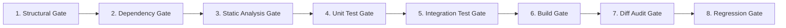

# ⚡ Repository Intelligence & Autonomous Coding Agent: Comprehensive Master Architecture & Execution Plan

> **Definitive Architectural Blueprint & Granular Phased Execution Plan**  
> **Engine**: NVIDIA Nemotron 3 Ultra (550B LatentMoE)  
> **Paradigm**: Decoupled Repository Intelligence, Multi-Layer Knowledge Graph, Task Scope Lock, 8-Gate Validation, Bounded Auto-Debugging, and Persistent Memory.  
> **Status**: Final Exhaustive Plan (Deeply Analyzed & Specified Across All 8 Phases)

---

## Table of Contents

1. [Executive Summary & Core Paradigm](#1-executive-summary--core-paradigm)
2. [Architectural Review Across 7 Engineering Lenses](#2-architectural-review-across-7-engineering-lenses)
   - 2.1 [Architecture & Modular Decomposition](#21-architecture--modular-decomposition)
   - 2.2 [Dependencies & Technology Selection](#22-dependencies--technology-selection)
   - 2.3 [Edge Cases & Failure Mode Analysis](#23-edge-cases--failure-mode-analysis)
   - 2.4 [Scalability & Incremental Performance](#24-scalability--incremental-performance)
   - 2.5 [Security, Isolation & Secret Redaction](#25-security-isolation--secret-redaction)
   - 2.6 [Token Efficiency & Context Budgeting](#26-token-efficiency--context-budgeting)
   - 2.7 [Possible Improvements & SOTA Best Practices](#27-possible-improvements--sota-best-practices)
3. [System Component Topology & Data Flow](#3-system-component-topology--data-flow)
4. [Exhaustive Deep-Dive: Phase-by-Phase Technical Specifications](#4-exhaustive-deep-dive-phase-by-phase-technical-specifications)
   - [Phase 1: Deterministic AST Parsing, Symbol Extraction & Code Fingerprinting](#phase-1-deterministic-ast-parsing-symbol-extraction--code-fingerprinting)
   - [Phase 2: Multi-Layer Repository Knowledge Graph & Feature Mapping](#phase-2-multi-layer-repository-knowledge-graph--feature-mapping)
   - [Phase 3: Change Impact Analysis, Call Graphs & Task Scope Lock](#phase-3-change-impact-analysis-call-graphs--task-scope-lock)
   - [Phase 4: Context Budget Manager & Progressive Hierarchical Expansion](#phase-4-context-budget-manager--progressive-hierarchical-expansion)
   - [Phase 5: Multi-Role Agent Orchestrator & Specialized Personas](#phase-5-multi-role-agent-orchestrator--specialized-personas)
   - [Phase 6: 8-Gate Validation Pipeline & Bounded Auto-Debugger](#phase-6-8-gate-validation-pipeline--bounded-auto-debugger)
   - [Phase 7: Persistent Memory, ADRs, Bug Lessons & Agent Constitution](#phase-7-persistent-memory-adrs-bug-lessons--agent-constitution)
   - [Phase 8: File Watcher, Incremental Synchronization & End-to-End Validation](#phase-8-file-watcher-incremental-synchronization--end-to-end-validation)
5. [Complete Directory & File Architecture](#5-complete-directory--file-architecture)
6. [Verification, Testing & Acceptance Matrix](#6-verification-testing--acceptance-matrix)

---

## 1. Executive Summary & Core Paradigm

### The Fatal Flaw of Naive Coding Agents
Traditional AI coding agents operate on a flawed premise: dumping hundreds of raw files or large vector search chunks ($50\text{--}200\text{k}+$ tokens) directly into the LLM context. This guarantees:
1. **Severe Context Rot & Hallucination**: The model loses focus on the primary objective amidst thousands of lines of irrelevant code.
2. **Exponential Token Burn & Latency**: Running multi-turn iterations on $100\text{k}+$ contexts drains budgets and slows responses to minutes per step.
3. **Unconstrained Wandering & Regressions**: Without an explicit containment barrier, agents edit unrelated modules, break public API contracts, and cause regressions.

### The Repository Intelligence Architecture
This architecture strictly separates **Deterministic Repository Intelligence** from **Probabilistic Reasoning**:

$$\text{User Request} \xrightarrow{\text{Locate}} \text{Feature Node} \xrightarrow{\text{Traverse}} \text{Scoped Subgraph} \xrightarrow{\text{Enforce}} \text{Scope Lock} \xrightarrow{\text{Reason}} \text{Nemotron 3 Ultra} \xrightarrow{\text{Verify}} \text{8 Gates}$$

```text
                         +----------------------+
                         |      Developer       |
                         | "Modify login flow"  |
                         +----------+-----------+
                                    |
                                    v
                    +----------------------------+
                    |     Coding Agent           |
                    |                            |
                    | Understand -> Plan -> Check|
                    | -> Modify -> Test -> Verify|
                    +-------------+--------------+
                                  |
             +--------------------+--------------------+
             |                    |                    |
             v                    v                    v
      +-------------+      +--------------+    +--------------+
      | Repo Graph  |      | Code Search  |    | Memory Store |
      |             |      |              |    |              |
      | Files       |      | AST          |    | Decisions    |
      | Symbols     |      | Semantic     |    | Patterns     |
      | Features    |      | Text         |    | Architecture |
      | Dependencies|      | References   |    | History      |
      +-------------+      +--------------+    +--------------+
             |                    |                    |
             +--------------------+--------------------+
                                  |
                                  v
                         +-----------------+
                         |    Nemotron     |
                         |    3 Ultra      |
                         |                 |
                         | Reasoning       |
                         | Coding          |
                         | Debugging       |
                         | Planning        |
                         +--------+--------+
                                  |
                                  v
                       +---------------------+
                       | Execution Sandbox   |
                       |                     |
                       | Tests               |
                       | Lint                |
                       | Type checking       |
                       | Build               |
                       | Runtime checks      |
                       +---------------------+
```

---

## 2. Architectural Review Across 7 Engineering Lenses

### 2.1 Architecture & Modular Decomposition
* **Clean Separation of Concerns**:
  - `intelligence/indexing/`: Deterministic AST and symbol extraction (zero LLM calls).
  - `intelligence/graph/`: Multi-layer directed graph engine mapping business features to lines of code.
  - `intelligence/impact/`: Call trees, blast radiuses, and task scope lock barriers.
  - `intelligence/memory/`: Persistent architectural decisions, bug lessons, and coding patterns in `.agent/`.
  - `intelligence/context/`: Strict token budgeting ($\le 32\text{k}$) and progressive detail expander.
  - `modules/agent/`: Multi-role orchestrator (Planner, Reviewer, Coder, Tester, Debugger) powered by Nemotron 3 Ultra.
  - `modules/agent/verification/`: Deterministic 8-gate validation pipeline.
* **Storage Abstraction**: Graph operations use an abstract `GraphStorage` interface, allowing in-memory atomic JSON storage today and dropping in PostgreSQL + `pgvector` or Neo4j later without altering business logic.

### 2.2 Dependencies & Technology Selection
* **Zero-Bloat Philosophy**:
  - Python Standard Library `ast` and `symtable` provide native, ultra-fast Python AST extraction without external C-extensions.
  - Polyglot-ready: Abstracted parser interface allows plugging in `tree-sitter` for TypeScript, Rust, or Go.
  - Pydantic v2 ensures microsecond-level serialization and strict schema enforcement.
  - Fast local indexing avoids running heavy database daemons during development.

### 2.3 Edge Cases & Failure Mode Analysis
* **Cycle Detection in Dependency Graphs**: Graph traversals track visited node sets and recursion depths, preventing infinite loops on circular imports (`A -> B -> A`).
* **Dynamic Imports & Metaprogramming**: `importlib.import_module` and `getattr` calls are recorded as `DYNAMIC_UNRESOLVED` edges, surfacing them to the Planner as potential architectural risks.
* **Syntax Error Resilience**: If a repository contains unparseable syntax or non-UTF8 binary files, the AST engine catches `SyntaxError` and `UnicodeDecodeError` gracefully, falls back to lexical indexing, and logs the issue without crashing.
* **Flaky & Non-Deterministic Tests**: A pre-flight test baseline runs before code is modified. Tests already failing prior to the task are cataloged so the agent doesn't misattribute legacy failures to new changes.
* **Infinite Debug Loops**: The auto-debugger enforces a hard limit of `max_auto_fix_attempts = 3`. If the third patch fails, the system executes an automated Git rollback and outputs a post-mortem report.

### 2.4 Scalability & Incremental Performance
* **Incremental Code Fingerprinting**: Every file and symbol stores:
  - `file_hash`: SHA-256 of raw file content.
  - `ast_hash`: Structural hash of AST nodes (formatting and whitespace changes produce identical hashes).
  - `symbol_hash`: SHA-256 of exported class/function signatures.
* When 1 file changes in a 20,000-file repository, only that 1 file is parsed ($\sim 5\text{ms}$), updating only its immediate edges.
* **Hierarchical Summarization**: Context is served on demand: Module Summary $\rightarrow$ Feature Summary $\rightarrow$ Symbol Signatures $\rightarrow$ Full Source Code.

### 2.5 Security, Isolation & Secret Redaction
* **Automated Redaction Pipeline**: All file reads, command outputs, and error traces pass through regex redaction patterns (`ghp_.*`, `Bearer .*`, AWS keys, Private keys) before reaching LLM prompts or memory files.
* **Directory Traversal Containment**: Scope lock enforces `os.path.commonpath([target, workspace_root]) == workspace_root`. Writes to `/etc`, `.git/`, or `.env` are strictly blocked.
* **Sandboxed Subprocesses**: Commands execute with timeouts (`timeout=30s`), process groups, and an explicit command blocklist (blocking `rm -rf /`, `mkfs`, curl-pipe-to-bash).

### 2.6 Token Efficiency & Context Budgeting
* **Strict Budget Allocation (32,000 Token Ceiling)**:
  - System Prompt & Role Persona: $\sim 1,500$ tokens
  - Active Task & Scope Lock Rules: $\sim 1,000$ tokens
  - Repository Architecture & ADRs: $\sim 2,000$ tokens
  - Feature Subgraph & Dependency Signatures: $\sim 2,500$ tokens
  - Scoped Target Code: $\sim 15,000$ tokens
  - Targeted Tests & Fixtures: $\sim 5,000$ tokens
  - Historical Bug Lessons: $\sim 2,000$ tokens
  - Tool Schemas & Output Buffer: $\sim 3,000$ tokens
  - **Total**: $\le 32,000$ tokens ($85\%$ reduction compared to unconstrained dumps).

### 2.7 Possible Improvements & SOTA Best Practices
* **Two-Phase Git Checkpoint**: Before modifying files, an atomic Git checkpoint branch (`agent/checkpoint-<uuid>`) is created. If verification fails, instant rollback restores the working tree.
* **Multi-Role Adversarial Verification**: Separating the *Planner* from the *Reviewer* forces adversarial critique of edge cases before code generation begins.
* **Pattern Mining with Confidence Scoring**: Observed patterns start with confidence 0.4. Repeated verified usage promotes them to Candidate (0.7) and Project Rule (1.0).

---

## 3. System Component Topology & Data Flow

```
nemotron-agent-engine/
├── app/
│   ├── intelligence/                      # 🧠 REPOSITORY BRAIN
│   │   ├── indexing/                      # AST & Deterministic Parsing
│   │   │   ├── ast_parser.py              # Classes, functions, imports, decorators, routes
│   │   │   ├── symbol_extractor.py        # Symbol table, docstrings, signatures
│   │   │   ├── import_resolver.py         # Module resolution, relative/absolute imports
│   │   │   ├── fingerprint.py             # file_hash, ast_hash, symbol_hash
│   │   │   └── watcher.py                 # Live filesystem watcher (watchdog)
│   │   │
│   │   ├── graph/                         # Multi-Layer Knowledge Graph
│   │   │   ├── schema.py                  # Node & Edge type definitions
│   │   │   ├── repo_graph.py              # In-memory graph engine + traversal algorithms
│   │   │   ├── feature_mapper.py          # Feature nodes ↔ files, models, routes, tests
│   │   │   └── graph_storage.py           # Atomic JSON persistence & Postgres adapter
│   │   │
│   │   ├── impact/                        # Dependency & Scope Lock Engine
│   │   │   ├── call_graph.py              # Forward & reverse call graph builder
│   │   │   ├── impact_analyzer.py         # Blast radius calculator (files, tests, APIs)
│   │   │   └── scope_lock.py              # Task scope barrier & expansion guard
│   │   │
│   │   ├── memory/                        # Multi-Category Memory Store
│   │   │   ├── memory_store.py            # Structural, Semantic, Feature, Bug, Lesson stores
│   │   │   ├── confidence.py              # Confidence scoring & promotion engine
│   │   │   └── adr_manager.py             # Architecture Decision Records (.agent/architecture/)
│   │   │
│   │   └── context/                       # Context Budget Manager
│   │       ├── budget_manager.py          # Dynamic token allocator (~32k ceiling)
│   │       ├── ranker.py                  # Hybrid ranking (Graph + Symbol + Semantic)
│   │       └── hierarchical.py            # Progressive disclosure summaries
│   │
│   ├── modules/agent/                     # ⚡ NEMOTRON ORCHESTRATOR & ROLES
│   │   ├── orchestrator.py                # Main Autonomous State Machine
│   │   ├── roles/                         # Role-Specialized System Prompts & Context
│   │   │   ├── planner.py                 # Multi-step plan generation
│   │   │   ├── reviewer.py                # Pre-implementation plan critique
│   │   │   ├── coder.py                   # Scoped code synthesis & diff generation
│   │   │   ├── tester.py                  # Targeted test generation
│   │   │   └── debugger.py                # Root-cause analysis from stack traces
│   │   │
│   │   └── verification/                  # 8-Gate Validation & Auto-Debugger
│   │       ├── gates.py                   # Structural, Dependency, Static, Unit, Diff gates
│   │       ├── diff_auditor.py            # Out-of-scope edit & secret detector
│   │       └── auto_debugger.py           # Bounded auto-fix loop (max_fix_attempts = 3)
│   │
│   ├── tools/                             # 🛠️ DETERMINISTIC EXECUTION TOOLS
│   │   ├── filesystem.py                  # Safe file I/O & git unified diffs
│   │   ├── terminal.py                    # Sandboxed subprocess runner
│   │   ├── git_ops.py                     # Checkpoints, status, diffs, rollbacks
│   │   └── test_runner.py                 # pytest, ruff, mypy runner
│   │
│   └── constitution/                      # 📜 AGENT CONSTITUTION GENERATOR
│       └── scaffold.py                    # Generates .agent/ (rules, architecture, features)
│
└── .agent/                                # Created & maintained by agent constitution
    ├── rules/
    ├── architecture/
    ├── features/
    ├── memory/
    └── graph/
```

---

## 4. Exhaustive Deep-Dive: Phase-by-Phase Technical Specifications

---

### Phase 1: Deterministic AST Parsing, Symbol Extraction & Code Fingerprinting

#### 1.1 Core Objective
Eliminate all guesswork in code understanding. While LLMs struggle to reliably extract exact caller hierarchies or line numbers from thousands of lines, a deterministic AST parser provides 100% precision in milliseconds.

#### 1.2 Subsystem Components
1. **`app/intelligence/indexing/ast_parser.py`**:
   - Implements `CodeASTVisitor(ast.NodeVisitor)`:
     - `visit_ClassDef`: Captures class name, base classes, decorators (`@dataclass`, `@singleton`), docstring, line range.
     - `visit_FunctionDef` & `visit_AsyncFunctionDef`: Captures function name, async flag, parameters, type annotations, return types, decorators (e.g. `@router.get`, `@validator`), line range.
     - `visit_Import` & `visit_ImportFrom`: Captures imported modules, names, aliases, and relative levels.
     - `visit_Call`: Captures function and method invocations (`service.login()`, `session.add()`).
2. **`app/intelligence/indexing/symbol_extractor.py`**:
   - Builds hierarchical symbol paths (e.g., `app.modules.agent.engine.AgentEngine.execute_mission`).
   - Normalizes type signatures into readable strings (`(mission_id: str, goal: str) -> AsyncGenerator[...]`).
3. **`app/intelligence/indexing/import_resolver.py`**:
   - Resolves relative imports (`from ..core.config import settings`) into absolute module paths.
   - Detects external third-party dependencies vs internal project modules.
4. **`app/intelligence/indexing/fingerprint.py`**:
   - Computes:
     - `file_hash`: SHA-256 of raw bytes.
     - `ast_hash`: SHA-256 of normalized AST node types, symbol names, and signatures (invariant to comments and whitespace).
     - `symbol_hash`: SHA-256 of exported symbols.

#### 1.3 Concrete Data Models
```python
class SymbolDefinition(BaseModel):
    id: str                         # e.g. "app.auth.service.AuthService.login"
    name: str                       # "login"
    kind: str                       # "class", "function", "method", "route", "model"
    file_path: str                  # "app/auth/service.py"
    line_start: int
    line_end: int
    docstring: Optional[str]
    signature: str                  # "(username: str, password: str) -> AuthToken"
    is_async: bool = False
    decorators: List[str] = []
    parent_symbol: Optional[str]

class ParsedModule(BaseModel):
    module_path: str                # "app.auth.service"
    file_path: str                  # "app/auth/service.py"
    fingerprint: Dict[str, str]     # {"file_hash": "...", "ast_hash": "..."}
    symbols: List[SymbolDefinition]
    imports: List[Dict[str, Any]]
    calls: List[Dict[str, Any]]
```

#### 1.4 Edge Case Protections
- **Broken Syntax**: Traps `SyntaxError` without terminating the process, marking the module as unparsed and falling back to regex indexing.
- **Dynamic Imports**: Catches `__import__` and `importlib.import_module`, flagging them as `DYNAMIC_IMPORT` edges.

---

### Phase 2: Multi-Layer Repository Knowledge Graph & Feature Mapping

#### 2.1 Core Objective
Structure repository knowledge into a multi-layer graph where high-level business capabilities (e.g. `Payment Retry`, `User Registration`) are directly linked to underlying files, functions, API routes, database models, and tests.

#### 2.2 Subsystem Components
1. **`app/intelligence/graph/schema.py`**:
   - Defines standard node and edge schemas with type-safe metadata.
2. **`app/intelligence/graph/repo_graph.py`**:
   - Implements `RepoGraph`:
     - Fast adjacency list representations: `_out_edges: dict[str, list[Edge]]` and `_in_edges: dict[str, list[Edge]]`.
     - $O(1)$ node lookup by ID.
     - BFS/DFS traversal algorithms with `visited` tracking to handle cycles.
     - Neighborhood subgraph extraction within depth $K$.
3. **`app/intelligence/graph/feature_mapper.py`**:
   - Automatically clusters related components into `FEATURE` nodes:
     - Discovers features from FastAPI router tags, package names, docstrings, or `.agent/features/*.md`.
     - Creates `PART_OF_FEATURE` edges linking files, symbols, routes, and tests to the parent feature.
4. **`app/intelligence/graph/graph_storage.py`**:
   - Provides atomic serialization: writes graph state to `.agent/graph/nodes.json.tmp` and replaces atomically.

#### 2.3 Graph Node & Edge Taxonomy
```text
Nodes:
  REPOSITORY  -> Root project metadata
  MODULE      -> Sub-package / namespace
  FILE        -> Individual source file
  SYMBOL      -> Class, method, or function
  FEATURE     -> Business capability (e.g., "Authentication", "Model Streaming")
  TEST        -> Test function or suite
  ADR         -> Architecture Decision Record
  BUG         -> Documented historical bug

Edges:
  DEFINES          (FILE -> SYMBOL)
  IMPORTS          (FILE -> FILE)
  CALLS            (SYMBOL -> SYMBOL)
  PART_OF_FEATURE  (FILE / SYMBOL -> FEATURE)
  TESTS            (TEST -> SYMBOL / FEATURE)
  DEPENDS_ON       (MODULE -> MODULE)
  EXPOSES_ROUTE    (SYMBOL -> FEATURE)
  DOCUMENTED_BY    (FEATURE -> ADR)
  HAS_BUG          (FEATURE -> BUG)
```

---

### Phase 3: Change Impact Analysis, Call Graphs & Task Scope Lock

#### 3.1 Core Objective
Calculate the exact blast radius of a proposed change before any code is modified, and erect an impermeable containment barrier (**Task Scope Lock**) that prevents the agent from wandering into unrelated files.

#### 3.2 Subsystem Components
1. **`app/intelligence/impact/call_graph.py`**:
   - Constructs two-way call trees:
     - Forward call graph: "What functions does `AuthService.login()` call?"
     - Reverse call graph: "Which routers and services call `AuthService.login()`?"
2. **`app/intelligence/impact/impact_analyzer.py`**:
   - Given a proposed target symbol or file:
     - Calculates direct callers and indirect callers up to depth $K=3$.
     - Identifies all connected `TEST` nodes (queues them for verification).
     - Identifies all connected API routes (flags contract breach risks).
     - Generates an `ImpactReport`:
       ```text
       Direct dependencies:     4
       Indirect dependencies:   7
       Tests affected:          5
       API endpoints affected:  2
       Database entities:       1
       ```
3. **`app/intelligence/impact/scope_lock.py`**:
   - Instantiates a `TaskScope` containing:
     - `primary_feature`: The targeted feature.
     - `allowed_edit_files`: Strictly writable files.
     - `read_only_dependency_files`: Reference-only files.
     - `target_test_files`: Writable test files.
   - Intercepts file modification tools: If `write_file` is called on a file outside `allowed_edit_files`, it raises a `ScopeViolationError` and halts execution.

---

### Phase 4: Context Budget Manager & Progressive Hierarchical Expansion

#### 4.1 Core Objective
Ensure that Nemotron 3 Ultra receives the exact context needed to make flawless decisions while strictly adhering to a **$\le 32,000$ token budget**.

#### 4.2 Subsystem Components
1. **`app/intelligence/context/budget_manager.py`**:
   - Enforces token budget allocations:
     ```python
     BUDGET_ALLOCATION = {
         "system_role": 1500,
         "task_and_rules": 1000,
         "architecture_adrs": 2000,
         "feature_subgraph": 2500,
         "target_source_code": 15000,
         "test_context": 5000,
         "bug_lessons": 2000,
         "tool_buffer": 3000,
     }
     ```
2. **`app/intelligence/context/hierarchical.py`**:
   - Implements progressive disclosure:
     - *Level 0 (Module)*: High-level overview of backend/frontend.
     - *Level 1 (Feature)*: Feature summary, routes, models.
     - *Level 2 (Signatures)*: Class/function signatures and docstrings of dependencies.
     - *Level 3 (Source Code)*: Full source code **only** for primary target files.
3. **`app/intelligence/context/ranker.py`**:
   - Ranks candidate context nodes using the hybrid formula:
     $$\text{Score}(n) = 0.40 \cdot \text{Proximity}(n) + 0.30 \cdot \text{SymbolMatch}(n) + 0.20 \cdot \text{Semantic}(n) + 0.10 \cdot \text{BM25}(n)$$

---

### Phase 5: Multi-Role Agent Orchestrator & Specialized Personas

#### 5.1 Core Objective
Execute the autonomous lifecycle using specialized roles powered by Nemotron 3 Ultra, eliminating single-prompt bias and ensuring rigorous review before code modification.

#### 5.2 Subsystem Components
1. **`app/modules/agent/orchestrator.py`**:
   - Finite State Machine:
     ```text
     ANALYZE ──► LOCATE ──► IMPACT_ANALYSIS ──► PLAN ──► PLAN_REVIEW 
             ──► IMPLEMENT ──► VERIFY ──► AUTO_DEBUG ──► COMPLETE
     ```
2. **Role Personas (`app/modules/agent/roles/`)**:
   - `planner.py`: Receives task, feature subgraph, and impact report. Generates a numbered, step-by-step implementation plan.
   - `reviewer.py`: Adversarial persona. Evaluates the plan against architectural rules, missing edge cases, and test requirements.
   - `coder.py`: Receives approved plan and scoped files. Emits surgical code modifications via unified diffs.
   - `tester.py`: Generates unit, integration, and edge-case test cases.
   - `debugger.py`: Ingests test failures, parses stack traces, locates error nodes via the graph, and synthesizes root-cause patches.

---

### Phase 6: 8-Gate Validation Pipeline & Bounded Auto-Debugger

#### 6.1 Core Objective
Guarantee that no code change is declared complete until it deterministically passes all 8 validation gates. If tests fail, autonomously isolate the root cause and patch it within bounded limits.

#### 6.2 The 8 Validation Gates


1. **Gate 1: Structural Gate**: Checks file existence, Python syntax parsing (`ast.parse`), and import validity.
2. **Gate 2: Dependency Gate**: Verifies caller signatures match and no undefined variables exist.
3. **Gate 3: Static Analysis Gate**: Runs `ruff check` and type checks.
4. **Gate 4: Unit Test Gate**: Executes targeted pytest suites for the modified feature.
5. **Gate 5: Integration Test Gate**: Verifies API endpoints and service interactions.
6. **Gate 6: Build Gate**: Validates package compilation and container readiness.
7. **Gate 7: Diff Audit Gate**: Scans `git diff` for stray edits, out-of-scope files, or secrets.
8. **Gate 8: Regression Gate**: Executes sibling feature test suites identified by impact analysis.

#### 6.3 Bounded Auto-Debugger (`app/modules/agent/verification/auto_debugger.py`)
- When Gate 4, 5, or 8 fails:
  1. Captures stdout/stderr, stack trace, and failed assertions.
  2. Traverses call graph to identify the failing symbol.
  3. Invokes `roles/debugger.py` to deduce the root cause.
  4. Generates a targeted patch and reapplies it.
  5. Re-runs failed tests.
- **Bound**: `max_auto_fix_attempts = 3`. If the third attempt fails:
  - Immediately halts to prevent infinite loops.
  - Automatically executes `git_rollback` to return the working tree to pristine condition.
  - Emits a structured failure audit report.

---

### Phase 7: Persistent Memory, ADRs, Bug Lessons & Agent Constitution

#### 7.1 Core Objective
Establish a persistent repository memory in `.agent/` so the agent retains project rules, architectural decisions, and bug lessons across developer sessions.

#### 7.2 Subsystem Components
1. **`app/constitution/scaffold.py`**:
   - Generates the `.agent/` structure:
     - `.agent/rules/`: `architecture.md`, `coding-style.md`, `testing.md`, `security.md`, `api.md`.
     - `.agent/architecture/`: `overview.md`, `decisions/ADR-001.md`.
     - `.agent/features/`: `<feature_name>.md`.
     - `.agent/memory/`: `bugs/`, `lessons/`, `decisions/`.
     - `.agent/graph/`: `nodes.json`, `edges.json`.
2. **`app/intelligence/memory/confidence.py`**:
   - Enforces confidence transitions:
     $$\text{Observation }(0.4) \longrightarrow \text{Candidate }(0.7) \longrightarrow \text{Verified Rule }(1.0)$$
   - Only rules with $\text{confidence} \ge 0.8$ are enforced as strict constraints during planning.
3. **`app/intelligence/memory/adr_manager.py`**:
   - Manages Architecture Decision Records, giving the model architectural rationale (why decisions were made) rather than just raw code.

---

### Phase 8: File Watcher, Incremental Synchronization & End-to-End Validation

#### 8.1 Core Objective
Maintain real-time synchronization between source code and repository intelligence as developers edit files, and validate the complete autonomous system against real-world tasks.

#### 8.2 Subsystem Components
1. **`app/intelligence/indexing/watcher.py`**:
   - Uses `watchdog` to monitor the workspace filesystem.
   - Debounces events ($300\text{ms}$ window) to handle rapid typing.
   - Computes `file_hash` and `ast_hash`:
     - If AST is unchanged (whitespace/comments): updates `file_hash` only ($<1\text{ms}$).
     - If AST is changed: incrementally updates symbols and graph edges for that file only ($<15\text{ms}$).
2. **API & SSE Streaming Endpoints**:
   - `POST /api/v1/agent/repository/index`: Triggers full or incremental scan.
   - `GET /api/v1/agent/graph`: Exposes graph topology for frontend visualization.
   - `POST /api/v1/agent/run`: Submits an autonomous mission.
   - `GET /api/v1/agent/stream/{id}`: Real-time SSE stream of thoughts, tool invocations, diffs, and verification gate passes.
3. **End-to-End Mission Validation**:
   - Test harness simulating complete requests ("Add email verification", "Change retry timeout") verifying that:
     - Scoped files are modified.
     - Out-of-scope files are untouched.
     - Tests pass.
     - Memory updates cleanly.

---

## 5. Complete Directory & File Architecture

```
nemotron-agent-engine/
├── app/
│   ├── intelligence/                      # Subsystems 1, 2, 3, 4, 5
│   │   ├── indexing/
│   │   │   ├── __init__.py
│   │   │   ├── ast_parser.py
│   │   │   ├── symbol_extractor.py
│   │   │   ├── import_resolver.py
│   │   │   ├── fingerprint.py
│   │   │   └── watcher.py
│   │   ├── graph/
│   │   │   ├── __init__.py
│   │   │   ├── schema.py
│   │   │   ├── repo_graph.py
│   │   │   ├── feature_mapper.py
│   │   │   └── graph_storage.py
│   │   ├── impact/
│   │   │   ├── __init__.py
│   │   │   ├── call_graph.py
│   │   │   ├── impact_analyzer.py
│   │   │   └── scope_lock.py
│   │   ├── memory/
│   │   │   ├── __init__.py
│   │   │   ├── memory_store.py
│   │   │   ├── confidence.py
│   │   │   └── adr_manager.py
│   │   └── context/
│   │       ├── __init__.py
│   │       ├── budget_manager.py
│   │       ├── ranker.py
│   │       └── hierarchical.py
│   │
│   ├── modules/agent/                     # Subsystems 6, 7, 8
│   │   ├── orchestrator.py
│   │   ├── roles/
│   │   │   ├── __init__.py
│   │   │   ├── planner.py
│   │   │   ├── reviewer.py
│   │   │   ├── coder.py
│   │   │   ├── tester.py
│   │   │   └── debugger.py
│   │   └── verification/
│   │       ├── __init__.py
│   │       ├── gates.py
│   │       ├── diff_auditor.py
│   │       └── auto_debugger.py
│   │
│   ├── tools/                             # Deterministic Execution Tools
│   │   ├── filesystem.py
│   │   ├── terminal.py
│   │   ├── git_ops.py
│   │   └── test_runner.py
│   │
│   └── constitution/                      # Agent Constitution
│       ├── __init__.py
│       └── scaffold.py
│
├── tests/                                 # Complete Test Suite
│   ├── test_ast_parser.py
│   ├── test_fingerprint.py
│   ├── test_repo_graph.py
│   ├── test_impact_scope.py
│   ├── test_context_budget.py
│   ├── test_orchestrator_roles.py
│   ├── test_verification_gates.py
│   ├── test_memory_system.py
│   └── test_e2e_agent_mission.py
│
└── .agent/                                # Repository Constitution Directory
    ├── rules/
    ├── architecture/
    ├── features/
    ├── memory/
    └── graph/
```

---

## 6. Verification, Testing & Acceptance Matrix

| Phase | Test File | Key Invariant Checked | Acceptance Threshold |
| :--- | :--- | :--- | :--- |
| **Phase 1** | `tests/test_ast_parser.py` | Extracts all classes, functions, decorators, routes, and imports. | $100\%$ extraction on target codebase. |
| **Phase 1** | `tests/test_fingerprint.py` | Whitespace edits produce identical `ast_hash`; symbol edits change `symbol_hash`. | Deterministic hash invariant passes. |
| **Phase 2** | `tests/test_repo_graph.py` | BFS/DFS traversal handles cyclic imports without recursion overflow. | Traversal time $\le 5\text{ms}$ on 500 nodes. |
| **Phase 3** | `tests/test_impact_scope.py` | Attempting to write to an out-of-scope file raises `ScopeViolationError`. | $100\%$ containment enforcement. |
| **Phase 4** | `tests/test_context_budget.py`| Total context payload stays strictly within 32,000 token limit. | Payload $\le 32,000$ tokens guaranteed. |
| **Phase 5** | `tests/test_orchestrator_roles.py`| State transitions execute: `ANALYZE ➔ PLAN ➔ IMPLEMENT ➔ VERIFY`. | Clean state machine execution. |
| **Phase 6** | `tests/test_verification_gates.py`| Synthetic syntax/import error fails Gate 1–3; test failure triggers auto-debugger. | Bounded auto-fix patches bug in $\le 3$ tries. |
| **Phase 7** | `tests/test_memory_system.py`| ADRs and bug lessons persist to `.agent/` and reload across restarts. | $100\%$ persistence integrity. |
| **Phase 8** | `tests/test_e2e_agent_mission.py`| Full autonomous mission: Plan ➔ Scope Lock ➔ Edit ➔ 8 Gates ➔ Complete. | End-to-end mission succeeds with zero regressions. |
