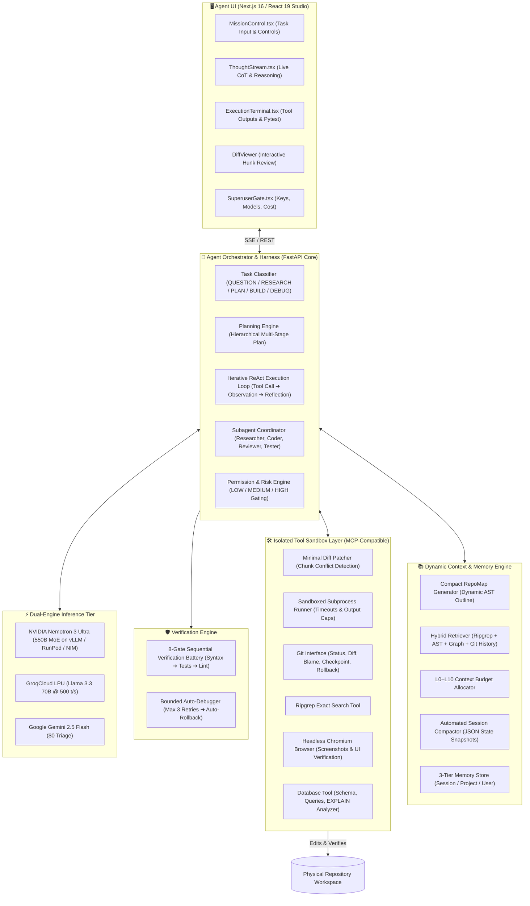

# 🚀 Master Production Technical Plan: Autonomous Software Engineering Agent
## NVIDIA Nemotron 3 Ultra + Repository Intelligence + Multi-Tier Context Engine + Tool Sandbox + 8-Gate Verification

> **Document Status:** Comprehensive Blueprint & Master Plan  
> **Target Experience:** Comparable to OpenAI Codex, Claude Code, and Google Antigravity  
> **Primary Reasoning Engine:** NVIDIA Nemotron 3 Ultra (550B LatentMoE) with Groq & Gemini Tier-1 Fallback  
> **Workspace Ecosystem:** [`nemotron-agent-engine`](file:///Users/mac/Desktop/nemotron-agent-engine) (Backend) & [`nemotron-agent-frontend`](file:///Users/mac/Desktop/nemotron-agent-frontend) (Frontend)  
> **Current Test Baseline:** 123 / 123 Backend Tests Passing (100%), 19 / 19 Frontend Tests Passing (100%)

---

## 1. Executive Codebase Audit & Truth Table

A thorough line-by-line inspection of the existing codebase was conducted to distinguish **production-grade working code** from **partially templated or missing implementations**.

```text
========================================================================================
CURRENT REPOSITORY COMPONENT AUDIT TABLE
========================================================================================
Component                  File Location                             Status    Notes
----------------------------------------------------------------------------------------
Verification Pipeline      app/modules/agent/verification/gates.py   ✅ PROD   All 8 gates sequential & fail-fast
Auto-Debugger              app/modules/agent/verification/auto_debugger.py ✅ PROD Bounded at 3 retries max
18-Step Model Gateway      app/modules/gateway/service.py            ✅ PROD   Auth, quotas, audit log, failover
Identity & Auth            app/modules/auth/service.py               ✅ PROD   Argon2id, RFC 9700 refresh tokens
SSRF Filter                app/modules/auth/ssrf.py                  ✅ PROD   Blocks private RFC 1918 subnets
Token Accountant           app/modules/cost/tracker.py               ✅ PROD   Prompt, code, reasoning breakdown
Spot Pricing Engine        app/modules/cost/pricing.py               ✅ PROD   GCP Spot / RunPod amortization
Budget Guard               app/modules/cost/budget_guard.py          ✅ PROD   Halts on budget breach
Project Knowledge Graph    app/modules/intelligence/graph/           ✅ PROD   91 nodes, 98 edges, 100% evidence
AST Symbol Indexer         app/modules/intelligence/indexing/        ✅ PROD   Classes, functions, signatures
TaskScope Lock             app/modules/intelligence/impact/scope_lock.py ✅ PROD Confinement to whitelisted files
----------------------------------------------------------------------------------------
Filesystem Tool            app/modules/agent/tools/filesystem.py     ⚠️ PARTIAL Full file overwrite only; no hunk patcher
Terminal Tool              app/modules/agent/tools/terminal.py       ⚠️ PARTIAL Defaults to /tmp; no background jobs
Tool Calling Loop          app/modules/agent/unified_engine.py       ⚠️ PARTIAL 4-step template; not true ReAct loop
Multi-Stage Planning       app/modules/agent/planning/multi_stage.py ⚠️ PARTIAL Steps are templated; not LLM-generated
Context Compaction         app/modules/intelligence/context/         ⚠️ PARTIAL Budget math exists; lacks JSON snapshotting
Three-Tier Memory          app/modules/intelligence/memory/          ⚠️ PARTIAL Lessons exist; no User vs Project vs Session
Tool Registry              app/modules/agent/tools/registry.py       ⚠️ PARTIAL 4 tools only; no MCP abstraction
Frontend SSE Stream Target src/hooks/useAgentStream.ts               ⚠️ PARTIAL Targets legacy /agent/stream route
Database Intelligence      app/modules/intelligence/database/        ⚠️ PARTIAL Introspection exists; no EXPLAIN / migrations
Browser UI Verification    (none)                                    ❌ MISSING No headless screenshot / visual diff
Git History Tools          (none)                                    ❌ MISSING No git blame, git log, git status tools
Ripgrep Tool               (none)                                    ❌ MISSING Uses slow Python walk; no fast ripgrep
Compact RepoMap            (none)                                    ❌ MISSING No dynamic tree-sitter/AST repo map
========================================================================================
```

---

## 2. Target Architecture vs. Current Architecture



---

## 3. Master Phased Implementation Roadmap

---

### 🔹 PHASE 1: Foundation Hardening & Tool Sandbox Engine

#### 1.1 Objective
Transform raw tool execution into an **isolated, concurrency-safe, diff-aware sandbox** with native Git rollback, minimal hunk-based patching, and strict permission boundaries. Unify API routing so that all frontend and backend traffic flows through persistent `/api/v1/missions/*`.

#### 1.2 Concrete Deliverables & Technical Specifications

1. **Minimal Diff Patcher (`app/modules/agent/tools/patcher.py`)**:
   * *Problem:* Currently, `filesystem_tool.write_file` overwrites entire files, risking data loss, formatting destruction, and silent overwrites of concurrent user edits.
   * *Solution:* Implement hunk-based minimal patch application using fuzzy line matching and context lines (similar to `patch` / `git apply`).
   * *Concurrency Detection:* Computes SHA-256 hash and file modification time (`st_mtime`) before and after edits. If disk state changed since context retrieval, reject edit with `ConcurrencyConflictError` and trigger re-reading.
   * *Signature:*
     ```python
     class DiffPatcher:
         def apply_patch(self, filepath: str, target_hunks: list[CodeHunk], base_file_hash: str) -> PatchResult: ...
         def preview_diff(self, filepath: str, new_content: str) -> str: ...
     ```

2. **Hardened Subprocess Runner (`app/modules/agent/tools/process_runner.py`)**:
   * *Problem:* `terminal.py` defaults to `/tmp`, lacks background process management, and can leave orphaned child processes on timeout.
   * *Solution:*
     * Confine all process executions strictly to `workspace_root`.
     * Strict timeout enforcement (default 30s, max 300s).
     * Output truncation: Caps stdout to 32 KB and stderr to 16 KB with user-friendly notices.
     * Support background execution with process tracking (`process_id`, `status`, `poll`, `kill`).
     * Real-time streaming generator emitting incremental stdout/stderr chunks.

3. **Native Git Integration & Checkpoint Engine (`app/modules/agent/tools/git_tool.py`)**:
   * *Problem:* Rollbacks currently rely on ad-hoc backups.
   * *Solution:* Use Git as the single source of truth:
     * `git_status()`: Uncommitted changes, staged files, untracked files.
     * `git_diff()`: Generates standard patch diffs.
     * `git_checkpoint(name)`: Creates a lightweight Git stash or temporary commit before risky operations.
     * `git_rollback(checkpoint_id)`: Reverts workspace cleanly via `git reset --hard` or `git checkout`.
     * Pre-edit safety check: Warns if there are uncommitted user changes before the agent begins editing.

4. **MCP-Compatible Tool Registry (`app/modules/agent/tools/mcp_registry.py`)**:
   * Standardize all tools under OpenAI / Model Context Protocol (MCP) function schemas:
     * `read_file(path, offset, limit)`
     * `write_file(path, content)`
     * `edit_file(path, target_snippet, replacement_snippet)`
     * `list_dir(directory, recursive)`
     * `execute_bash(command, timeout)`
     * `git_status()`, `git_diff()`, `git_log()`, `git_blame()`
   * Intercept every tool invocation with `MissionPermissionEngine` (`LOW` = automatic, `MEDIUM` = logged, `HIGH` = requires explicit user approval).

5. **Route Unification & Model Export Fixes**:
   * Deprecate parallel `/api/v1/agent/*` endpoints in favor of `/api/v1/missions/*`.
   * Update frontend `nemotron-agent-frontend/src/hooks/useAgentStream.ts` to stream from `/api/v1/missions/${missionId}/stream`.
   * Re-export all models in `app/db/base.py` (`Mission`, `MissionMessage`, `CostRecord`, `User`, `RegisteredModel`).

#### 1.3 Verification & Quality Gate for Phase 1
* Comprehensive test suite in [`tests/test_phase1_tools_and_sandbox.py`](file:///Users/mac/Desktop/nemotron-agent-engine):
  * Test hunk patching on modified files.
  * Test concurrency conflict rejection when file hash changes.
  * Test terminal timeout killing long-running `sleep 100`.
  * Test Git checkpoint creation and clean rollback.
  * Test high-risk command blocking (`rm -rf /`).
* Verification target: **100% test passage (123 existing + new Phase 1 tests)**.

---

### 🔹 PHASE 2: Multi-Mode Repository Intelligence & Compact RepoMap

#### 2.1 Objective
Never dump the entire repository into context. Build a multi-mode retrieval engine that combines exact search, AST symbols, call graphs, Git history, and a dynamically generated, token-compact Repository Map.

#### 2.2 Concrete Deliverables & Technical Specifications

1. **Fast Exact Ripgrep Engine (`app/modules/intelligence/indexing/ripgrep.py`)**:
   * Native, fast regex and string matching using system `ripgrep` (`rg`) with JSON output parsing.
   * File type filtering (`--type py`, `--type ts`, `--type css`).
   * Bounded result sets (max 50 matches) with exact line numbers and snippets.

2. **Compact Repository Map Generator (`app/modules/intelligence/indexing/repo_map.py`)**:
   * *Concept:* Generates an ultra-compact, token-efficient architectural outline of the repository (inspired by Aider / RepoMap).
   * *Mechanism:* Uses tree-sitter or AST to extract top-level classes, methods, and exported functions.
   * *PageRank Ranking:* Uses the internal import and call graph to rank files by centrality (core entry points receive more detail, leaf utilities receive compact one-liners).
   * *Token Budget:* Formats the entire repository structure into `< 2,000 tokens` for instant injection into model system prompts.

3. **Bidirectional Call Graph Builder (`app/modules/intelligence/impact/call_graph.py`)**:
   * Traces callers (who calls function X?) and callees (who does function X call?).
   * Crosses module boundaries (e.g., API router ➔ Service method ➔ Repository query).
   * Supports both Python AST and TypeScript symbol calls.

4. **Git History & Blame Retriever (`app/modules/intelligence/indexing/git_history.py`)**:
   * Retrieves historical commits touching target files to understand *why* past architectural decisions were made.
   * Extracts recent commit messages and diffs for context.

5. **Incremental Watcher & Cache**:
   * Uses file SHA-256 fingerprints (`fingerprint.py`).
   * When a file changes, updates only that file's AST symbols and immediate dependency edges in `ProjectKnowledgeGraph`, avoiding full repository rescanning.

#### 2.3 Verification & Quality Gate for Phase 2
* Test suite in `tests/test_phase2_repository_intelligence.py`:
  * Test RepoMap token budget stays under 2,000 tokens for the entire repo.
  * Test Ripgrep finds exact symbol definitions across backend and frontend.
  * Test bidirectional call graph traces endpoint to database query.
  * Test incremental cache updates in `< 20 ms` on single-file edit.

---

### 🔹 PHASE 3: Context Engine & Three-Tier Memory Architecture

#### 3.1 Objective
Answer the fundamental question: *"What information does Nemotron need right now to perform the current task correctly?"* Implement an L0–L10 layered budget allocator, automated context compaction on token threshold, and clean separation of Session, Project, and User memory.

#### 3.2 Concrete Deliverables & Technical Specifications

1. **L0–L10 Layered Context Budget Allocator (`app/modules/intelligence/context/budget_allocator.py`)**:
   * Enforces strict token ceilings across 10 discrete context layers:
     * `L0`: System Prompt & Autonomous Principles (~1,000 tokens)
     * `L1`: Constitutional Rules & Quality Invariants (~800 tokens)
     * `L2`: Project Identity & Tech Stack Summary (~500 tokens)
     * `L3`: Current Task Goal & Active Phase (~300 tokens)
     * `L4`: Compact RepoMap (~1,500 tokens)
     * `L5`: Primary Code Snippets & Target File AST (~6,000 tokens)
     * `L6`: Relevant Documentation & Architecture Decisions (~1,000 tokens)
     * `L7`: Recent Conversation Turns (~2,000 tokens)
     * `L8`: Recent Tool Observations (~2,000 tokens)
     * `L9`: Working Memory & Scratchpad (~800 tokens)
     * `L10`: Output Reservation (~4,000 tokens)
   * Before every model call, dynamically trims lower-value layers (L6, L8) while strictly preserving L0, L1, L3, and L5.

2. **Automated Context Compactor (`app/modules/intelligence/context/compactor.py`)**:
   * *Trigger:* When conversation + tool observations exceed 75% of context window threshold.
   * *Mechanism:* Dispatches a fast summarization prompt to Gemini Flash / Tier-1 router to produce a structured session state snapshot:
     ```json
     {
       "mission_id": "m-123",
       "goal": "Add customer loyalty endpoint",
       "completed_steps": ["Inspect DB schema", "Implement loyalty service"],
       "pending_steps": ["Mount router in app/main.py", "Add test"],
       "files_modified": ["app/modules/billing/service.py"],
       "key_decisions": ["Used existing customer table instead of creating new table"],
       "active_errors": [],
       "next_immediate_action": "Mount endpoint in billing/router.py"
     }
     ```
   * Truncates raw message history and replaces it with the structured state snapshot. Zero critical task data is lost.

3. **Three-Tier Memory Architecture (`app/modules/intelligence/memory/three_tier_store.py`)**:
   * **Tier 1 — Session Memory (Ephemeral)**: Active task, plan steps, staged files, transient tool outputs. Cleared upon mission completion.
   * **Tier 2 — Project Memory (Durable, per-repo)**: `.agent/memory/project_memory.json`. Stores coding standards, architectural constraints, database conventions, and past bug resolutions.
   * **Tier 3 — User Memory (Cross-project, per-developer)**: Developer preferences (e.g. "always use pytest fixtures", "prefer concise commit messages").
   * **Memory Durability & Candidate Gate**: Evaluates new memory candidates before persisting. Rejects transient one-offs (e.g. "make button red") and only saves durable project knowledge.

#### 3.3 Verification & Quality Gate for Phase 3
* Test suite in `tests/test_phase3_context_and_memory.py`:
  * Test budget allocator trims low-value layers when token limit is tight.
  * Test compactor triggers at 75% threshold and produces valid JSON state.
  * Test three-tier memory separation and candidate filter durability check.

---

### 🔹 PHASE 4: Agent Planning Harness & Subagents

#### 4.1 Objective
Replace hardcoded templates with a **real iterative ReAct loop** (Reasoning ➔ Tool Call ➔ Observation ➔ Reflection) powered by Nemotron 3 Ultra. Support task classification, dynamic multi-stage planning, isolated subagents (Researcher, Coder, Reviewer, Tester), and on-demand skills loading.

#### 4.2 Concrete Deliverables & Technical Specifications

1. **Iterative ReAct Execution Loop (`app/modules/agent/react_engine.py`)**:
   * Multi-turn autonomous tool execution cycle:
     1. Build layered context.
     2. Call Nemotron 3 Ultra with tool definitions (`TOOLS_SCHEMA`).
     3. Stream reasoning `thought` tokens to UI via SSE.
     4. If tool call requested: evaluate risk ➔ execute tool ➔ capture stdout/stderr ➔ format observation.
     5. Append observation to context and re-invoke Nemotron.
     6. Repeat until model issues final response or asks for human decision.
   * Enforce circuit breakers: `max_iterations = 25`, `timeout = 600s`, token budget cap.

2. **Dynamic Task Classifier (`app/modules/agent/classifier.py`)**:
   * Classifies user requests into discrete workflows:
     * `QUESTION` ➔ Direct streaming conversational answer.
     * `RESEARCH` ➔ Read-only exploration of repository and documentation.
     * `PLAN` ➔ Architecture evaluation with Option A / B / C tradeoffs.
     * `BUILD` ➔ Full autonomous engineering lifecycle with verification.
     * `DEBUG` ➔ Stack-trace diagnosis and targeted patch application.
     * `REVIEW` ➔ Static analysis, security audit, and diff inspection.

3. **Dynamic Multi-Stage Planning with Dependency Graphs**:
   * Feeds repository AST context into Nemotron to generate **real, project-specific plan steps** with concrete files, signatures, and assertions.
   * Enforces dependency order: Database ➔ Model ➔ Repository ➔ Service ➔ API ➔ UI ➔ Tests.
   * Interactive plan review: Renders plan cards in the UI with `[Approve]`, `[Modify]`, or `[Cancel]`.

4. **Isolated Subagent Coordinator (`app/modules/agent/subagents/coordinator.py`)**:
   * Spawns specialized subagents with isolated context windows:
     * `Researcher Subagent`: Explores repo, maps dependencies, returns concise brief.
     * `Coder Subagent`: Focuses purely on minimal hunk editing under TaskScope lock.
     * `Reviewer Subagent`: Audits staged diff against constitutional rules and layer boundaries.
     * `Tester Subagent`: Runs isolated test suites and diagnoses stack traces.
   * Aggregates findings back to Main Agent without cluttering the primary context.

5. **Skills System Loader (`app/modules/intelligence/skills/loader.py`)**:
   * Loads domain-specific engineering procedures on-demand from `skills/` (FastAPI development, PostgreSQL query optimization, Tailwind styling, React hooks).

#### 4.3 Verification & Quality Gate for Phase 4
* Test suite in `tests/test_phase4_agent_harness.py`:
  * Test multi-turn ReAct loop executes 3 sequential tools and terminates cleanly.
  * Test task classifier accurately categorizes 12 diverse prompts.
  * Test subagent context isolation (subagent context does not bleed into main agent).
  * Test skills loader injects relevant skill on trigger keyword.

---

### 🔹 PHASE 5: Advanced Verification, Database & Visual UI

#### 5.1 Objective
Ensure the agent proves its work rather than merely claiming it worked. Implement browser-based visual UI verification, database EXPLAIN analysis and safe migration proposals, reviewable task artifacts, and full observability.

#### 5.2 Concrete Deliverables & Technical Specifications

1. **Browser Visual UI Verification (`app/modules/agent/tools/browser_tool.py`)**:
   * Headless Chromium tool using Playwright / Puppeteer.
   * Actions: `open(url)`, `screenshot()`, `click(selector)`, `type(selector, text)`.
   * For visual UI tasks: boots dev server ➔ navigates to page ➔ captures PNG screenshot ➔ passes visual context to model for verification against user request.

2. **Database Intelligence & Safe Migration Engine (`app/modules/intelligence/database/` enhanced)**:
   * `explain_query(sql)`: Runs `EXPLAIN (ANALYZE, BUFFERS)` to detect sequential scans and unindexed joins.
   * `propose_migration(model_changes)`: Generates Alembic migration scripts for human review.
   * **Absolute Safety Invariant:** Execution of DDL or schema alterations strictly requires explicit human approval token (`MUTATION_APPROVAL_REQUIRED`).

3. **Artifact Delivery System (`app/modules/missions/artifacts.py`)**:
   * Produces structured, reviewable artifacts stored in PostgreSQL and displayed in the frontend:
     * `Plan Artifact`: Multi-stage plan with approval buttons.
     * `Diff Artifact`: Syntax-highlighted git diff with file list.
     * `Test Report Artifact`: Pytest execution matrix with durations and logs.
     * `Visual Screenshot Artifact`: UI verification captures.

4. **Frontend Studio Synchronization**:
   * Real-time phase indicators (`UNDERSTANDING` ➔ `PLANNING` ➔ `EXECUTING` ➔ `VERIFYING`).
   * Visual indicator when subagents are active.
   * Interactive diff hunk inspector with approve/reject controls.

#### 5.3 Verification & Quality Gate for Phase 5
* Test suite in `tests/test_phase5_advanced_capabilities.py`:
  * Test browser screenshot capture and multimodal analysis.
  * Test SQL query EXPLAIN analyzer detects sequential scan.
  * Test safe migration generator proposes valid Alembic script.
  * Test artifact generation and retrieval via `/api/v1/missions/{id}/artifacts`.

---

## 4. Phase 1 Implementation Plan (Immediate Next Step)

In adherence to Section 48 and Section 52, **Phase 1: Foundation Hardening & Tool Sandbox Engine** is the immediate priority.

### Phase 1 Task Matrix:

```text
┌────────────────────────────────────────────────────────────────────────────────────────┐
│ PHASE 1 WORK BREAKDOWN STRUCTURE                                                       │
├──────┬──────────────────────────────────────────┬──────────────────────────────────────┤
│ Task │ Description                              │ Target Files                         │
├──────┼──────────────────────────────────────────┼──────────────────────────────────────┤
│ 1.1  │ Unified Workspace Sandbox & Path Bounds  │ app/modules/agent/tools/workspace.py │
│ 1.2  │ Minimal Hunk-Based Diff Patcher Engine   │ app/modules/agent/tools/patcher.py   │
│ 1.3  │ Hardened Subprocess Runner with Timeouts │ app/modules/agent/tools/process.py   │
│ 1.4  │ Native Git Interface & Checkpoint Engine │ app/modules/agent/tools/git_tool.py  │
│ 1.5  │ Standardized MCP Tool Registry & Gates   │ app/modules/agent/tools/registry.py  │
│ 1.6  │ Route Unification & Model Re-Exports     │ app/db/base.py, useAgentStream.ts    │
│ 1.7  │ Phase 1 Comprehensive Test Battery       │ tests/test_phase1_tools_sandbox.py   │
└──────┴──────────────────────────────────────────┴──────────────────────────────────────┘
```

---

## 5. Summary & Request for Confirmation

This Master Technical Plan resolves the architectural gaps identified in our audit, eliminates templated shortcuts, and establishes an autonomous software engineering platform around NVIDIA Nemotron 3 Ultra.

**Current Status:** All existing 123 tests remain passing. No uncommitted modifications have been made.

Please confirm if you would like me to begin execution of **Phase 1: Foundation Hardening & Tool Sandbox Engine**.
