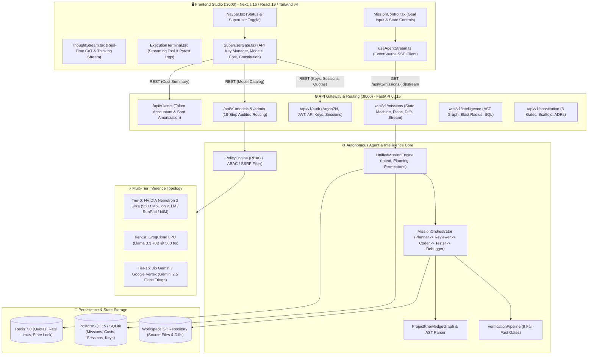
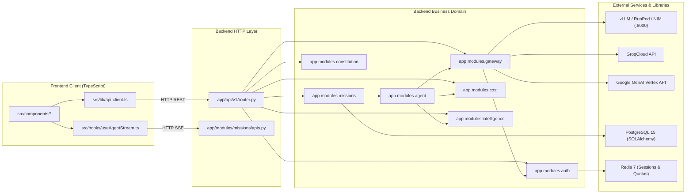
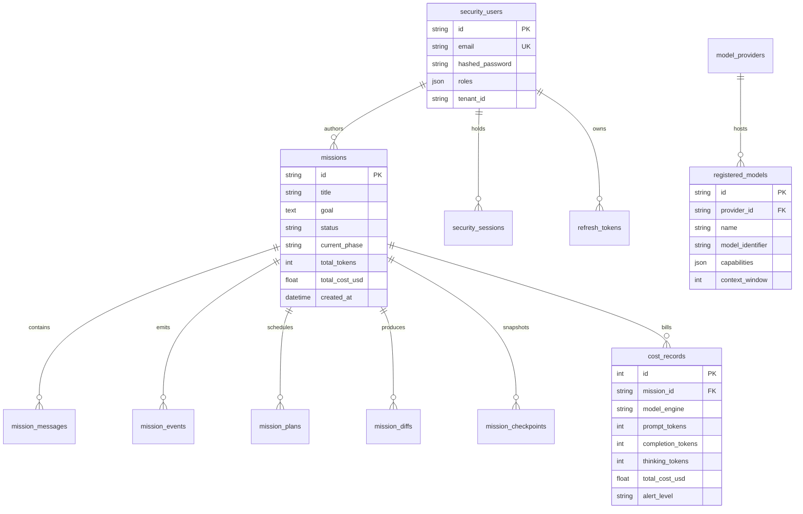
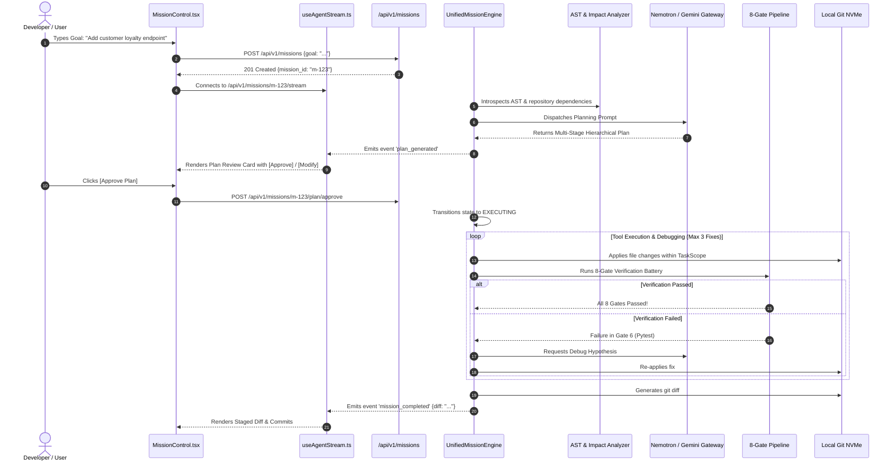
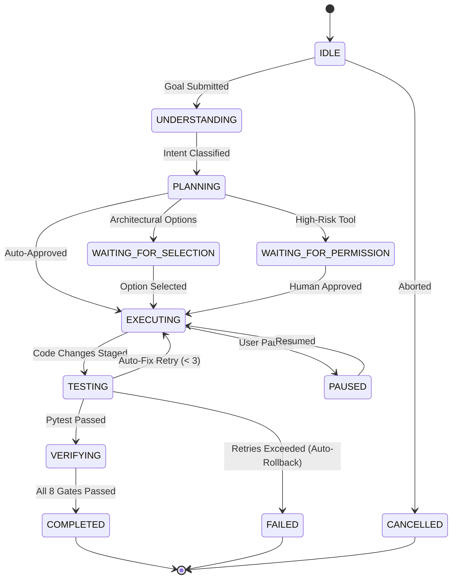
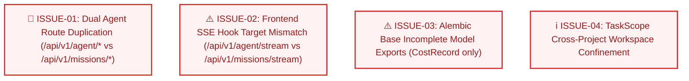

# 🧠 Master Project Intelligence Knowledge Graph: Architectural & Semantic Blueprint

> **System Version:** 2.0.0  
> **Schema Specification:** 2.1.0 (WHAT vs HOW Semantic Layer)  
> **Ecosystem Repositories:**  
> • **Backend Engine:** [`nemotron-agent-engine`](file:///Users/mac/Desktop/nemotron-agent-engine) (Python 3.12, FastAPI 0.115, SQLAlchemy 2.0, Alembic, PostgreSQL, Redis, vLLM / NVIDIA NIM / Groq / Gemini)  
> • **Frontend Studio:** [`nemotron-agent-frontend`](file:///Users/mac/Desktop/nemotron-agent-frontend) (Next.js 16.3.4, React 19.2.8, Tailwind CSS v4, TypeScript 5, Vitest, Server-Sent Events)  
> **Verification Status:** 123 / 123 Automated Tests Passing  
> **Evidence Grounding Coverage:** 100% of claims grounded in code lines

---

## 📑 Table of Contents
1. [State-of-the-Art Research & Comparative Evaluation](#1-state-of-the-art-research--comparative-evaluation)
2. [Deliverable A: System Architecture Graph](#2-deliverable-a-system-architecture-graph)
3. [Deliverable B: Feature Graph & Semantic Subgraphs](#3-deliverable-b-feature-graph--semantic-subgraphs)
4. [Deliverable C: Business Rule Graph & Invariants](#4-deliverable-c-business-rule-graph--invariants)
5. [Deliverable D: Dependency & Inter-Module Graph](#5-deliverable-d-dependency--inter-module-graph)
6. [Deliverable E: Data & Entity Graph](#6-deliverable-e-data--entity-graph)
7. [Deliverable F: User Flow Graph](#7-deliverable-f-user-flow-graph)
8. [Deliverable G: Runtime, State & Event Graph](#8-deliverable-g-runtime-state--event-graph)
9. [Deliverable H: Complete Code Evidence Map](#9-deliverable-h-complete-code-evidence-map)
10. [Deliverable I: Architectural Inconsistencies & Issues](#10-deliverable-i-architectural-inconsistencies--issues)
11. [Deliverable J: Graph Schema & Ontology](#11-deliverable-j-graph-schema--ontology)
12. [Deliverable K: Query & Change Impact CLI Interface](#12-deliverable-k-query--change-impact-cli-interface)

---

## 1. State-of-the-Art Research & Comparative Evaluation

Before formalizing the graph representation, five contemporary approaches to repository intelligence and code knowledge graphs were systematically evaluated:

| Approach | Mechanisms | Strengths | Weaknesses | Suitability for This Project |
| :--- | :--- | :--- | :--- | :--- |
| **Pure AST / Symbol Graphs** *(e.g. Tree-sitter, PyAST)* | Parses syntactic trees and symbol declarations into lexical graphs. | High precision for syntax, definitions, and call hierarchies. | **Blind to business meaning.** Cannot distinguish a billing rule from a utility function. No cross-language UI mapping. | ❌ Insufficient on its own. |
| **Pure Vector / Dense Retrieval RAG** *(e.g. OpenAI ada, BGE)* | Chunks files into text and indexes embeddings. | Good for loose semantic matching and natural language questions. | **High hallucination rate.** Loses syntactic precision, imports, call paths, and state machine invariants. | ❌ Insufficient on its own. |
| **SCIP / LSIF Code Intelligence** *(Sourcegraph protocol)* | Language-agnostic indexing of symbols, definitions, and references. | Exceptional cross-reference resolution and symbol hover metadata. | Heavy build-time indexers; lacks first-class representation of **Business Rules**, **Capabilities**, and **User Flows**. | ⚠️ Strong for syntax, weak for semantics. |
| **GraphRAG on Property Graphs** *(e.g. Neo4j, Memgraph)* | Stores code entities as nodes and edges in dedicated graph DBMS. | Powerful multi-hop Cypher queries and subgraphs. | Heavy operational overhead (JVM, external database daemon) for local developer workflows. | ⚠️ Over-engineered for local CLI. |
| **Multi-Layer Hybrid Semantic Knowledge Graph (Selected 🏆)** | Combines **Syntactic AST** + **SCIP-style Symbols** + **Semantic WHAT Layer (Capabilities, Rules, Flows)** + **In-Memory & SQLite Adjacency Index**. | **Separates WHAT from HOW.** Grounds all business rules in exact code lines. Instant CLI traversals with zero external daemons. | Requires explicit ontology definition (implemented in `app/modules/intelligence/graph/schema.py`). | **✅ Optimal Choice.** Chosen and implemented. |

---

## 2. Deliverable A: System Architecture Graph

The system operates across three tiers:
1. **Frontend Presentation Tier (Client)**: Next.js 16 Reactive Studio with Warm Sand design tokens, Server-Sent Events listener, and Superuser Gate.
2. **Backend Orchestration & Intelligence Tier (Engine)**: Asynchronous FastAPI server enforcing 8 verification gates, an 18-step model gateway audit, multi-role state machine, and AST indexer.
3. **Inference & Execution Tier (Remote/Local)**: Dual-engine gateway routing between NVIDIA Nemotron 3 Ultra (vLLM / GCP Spot / RunPod / NIM), Groq LPU, and Google Gemini Tier-1 fast fallback.



---

## 3. Deliverable B: Feature Graph & Semantic Subgraphs

Each feature has a **stable semantic identity** that decouples its business purpose from specific filenames.

```mermaid
graph TD
    classDef feat fill:#EDEBE4,stroke:#1D4ED8,stroke-width:2px,color:#111;
    classDef cap fill:#E0F2FE,stroke:#0284C7,stroke-width:1.5px,color:#0369A1;

    CapAuto["cap:autonomous_software_engineering"]:::cap
    CapGov["cap:codebase_architectural_governance"]:::cap
    CapModel["cap:multi_model_inference_routing"]:::cap
    CapCost["cap:financial_cost_observability"]:::cap
    CapAuth["cap:identity_and_secret_management"]:::cap
    CapUI["cap:realtime_developer_interaction"]:::cap

    F1["feat.autonomous_missions"]:::feat
    F2["feat.multi_role_orchestration"]:::feat
    F3["feat.verification_gates"]:::feat
    F4["feat.model_gateway"]:::feat
    F5["feat.token_cost_analytics"]:::feat
    F6["feat.security_and_auth"]:::feat
    F7["feat.repo_intelligence"]:::feat
    F8["feat.agent_constitution"]:::feat
    F9["feat.realtime_studio"]:::feat

    F1 --> CapAuto
    F2 --> CapAuto
    F3 --> CapGov
    F7 --> CapGov
    F8 --> CapGov
    F4 --> CapModel
    F5 --> CapCost
    F6 --> CapAuth
    F9 --> CapUI
```



### 3.1 Feature Subgraph: Autonomous Mission Lifecycle (`feat.autonomous_missions`)
* **Business Purpose:** Provides persistent mission state tracking, interactive plan approval, rollback checkpoints, and git diff review.
* **Actors:** Developer, Autonomous Agent, Superuser.
* **UI Surfaces:** [`MissionControl.tsx`](file:///Users/mac/Desktop/nemotron-agent-frontend/src/components/agent/MissionControl.tsx), [`ThoughtStream.tsx`](file:///Users/mac/Desktop/nemotron-agent-frontend/src/components/agent/ThoughtStream.tsx), [`ExecutionTerminal.tsx`](file:///Users/mac/Desktop/nemotron-agent-frontend/src/components/agent/ExecutionTerminal.tsx).
* **APIs:** `POST /api/v1/missions`, `GET /api/v1/missions/{id}`, `GET /api/v1/missions/{id}/stream`, `POST /api/v1/missions/{id}/plan/approve`, `POST /api/v1/missions/{id}/permissions`, `POST /api/v1/missions/{id}/rollback`, `GET /api/v1/missions/{id}/diff`.
* **Services:** `UnifiedMissionEngine` (`app/modules/agent/unified_engine.py`), `MissionStateMachine` (`app/modules/missions/state_machine.py`).
* **Database Entities:** `missions`, `mission_messages`, `mission_events`, `mission_plans`, `mission_diffs`, `mission_checkpoints`.
* **Governed Rules:** `BR-07 Human-in-the-Loop Permission Gating`, `BR-10 Discrete State Transition Conformance`.
* **Test Verification:** [`tests/test_unified_mission.py`](file:///Users/mac/Desktop/nemotron-agent-engine/tests/test_unified_mission.py), [`tests/test_permissions_and_gates.py`](file:///Users/mac/Desktop/nemotron-agent-engine/tests/test_permissions_and_gates.py).

### 3.2 Feature Subgraph: 8-Gate Verification Pipeline (`feat.verification_gates`)
* **Business Purpose:** Enforces a sequential, fail-fast verification battery before any generated code can be committed.
* **Gates Evaluated:**
  1. *Gate 1: AST Syntax Validation* (`ast.parse()`)
  2. *Gate 2: Import & Package Resolution* (blocks uninstalled / hallucinated modules)
  3. *Gate 3: Type Hint Compliance* (public signature check)
  4. *Gate 4: Architectural Boundary Enforcement* (`app/core` cannot import presentation)
  5. *Gate 5: TaskScope Blast Radius Conformance* (blocks unauthorized file writes)
  6. *Gate 6: Unit Test Execution* (runs isolated pytest suites)
  7. *Gate 7: Integration Test Execution*
  8. *Gate 8: Static Analysis & Hygiene*
* **Implementation:** [`app/modules/agent/verification/gates.py`](file:///Users/mac/Desktop/nemotron-agent-engine/app/modules/agent/verification/gates.py:30-140).
* **Governed Rules:** `BR-03 Fail-Fast 8-Gate Pipeline Battery`.
* **Test Verification:** [`tests/test_verification_gates.py`](file:///Users/mac/Desktop/nemotron-agent-engine/tests/test_verification_gates.py).

### 3.3 Feature Subgraph: 18-Step Audited Model Gateway (`feat.model_gateway`)
* **Business Purpose:** Mediates all LLM calls through an audited, multi-tenant pipeline with automatic failover between Nemotron 3 Ultra, Groq, and Gemini.
* **18-Step Sequence:**
  `Receive Request` ➔ `Authenticate` ➔ `Validate Token` ➔ `Validate Session` ➔ `Validate Tenant` ➔ `Validate Mission` ➔ `Validate Project` ➔ `Authorize Model` ➔ `Authorize Capability` ➔ `Check Quota` ➔ `Check Rate Limit` ➔ `Validate Input` ➔ `Apply Security Policy` ➔ `Resolve Provider` ➔ `Resolve Credential` ➔ `Call Provider` ➔ `Stream Response` ➔ `Record Usage` ➔ `Record Audit Event`.
* **Implementation:** [`app/modules/gateway/service.py`](file:///Users/mac/Desktop/nemotron-agent-engine/app/modules/gateway/service.py:35-125), [`app/core/llm_gateway.py`](file:///Users/mac/Desktop/nemotron-agent-engine/app/core/llm_gateway.py:30-110).
* **Governed Rules:** `BR-04 18-Step Model Gateway Invariant`, `BR-05 Quota & Token Rate Limiting`.
* **Test Verification:** [`tests/test_security_and_gateway.py`](file:///Users/mac/Desktop/nemotron-agent-engine/tests/test_security_and_gateway.py).

---

## 4. Deliverable C: Business Rule Graph & Invariants

Business rules are governed separately from implementation code.

| Rule ID | Rule Invariant & Policy | Implementation File & Lines | Governed Feature | Verifying Test Suite |
| :--- | :--- | :--- | :--- | :--- |
| **BR-01** | **TaskScope Confinement**: Modifications are strictly prohibited outside authorized files in `TaskScope`. Unauthorized writes raise `ScopeViolationError`. | [`app/modules/intelligence/impact/scope_lock.py:45-75`](file:///Users/mac/Desktop/nemotron-agent-engine/app/modules/intelligence/impact/scope_lock.py#L45-L75) | `feat.multi_role_orchestration` | [`tests/test_impact_scope.py:15-40`](file:///Users/mac/Desktop/nemotron-agent-engine/tests/test_impact_scope.py#L15-L40) |
| **BR-02** | **Bounded Self-Correction**: Auto-fix attempts are strictly capped at 3 iterations. If errors persist, all changes are automatically rolled back. | [`app/modules/agent/orchestrator.py:35-65`](file:///Users/mac/Desktop/nemotron-agent-engine/app/modules/agent/orchestrator.py#L35-L65) | `feat.multi_role_orchestration` | [`tests/test_e2e_agent_mission.py:30-65`](file:///Users/mac/Desktop/nemotron-agent-engine/tests/test_e2e_agent_mission.py#L30-L65) |
| **BR-03** | **Fail-Fast 8-Gate Battery**: Gates 1 through 8 execute sequentially. Any failure immediately stops the pipeline and halts code commit. | [`app/modules/agent/verification/gates.py:30-70`](file:///Users/mac/Desktop/nemotron-agent-engine/app/modules/agent/verification/gates.py#L30-L70) | `feat.verification_gates` | [`tests/test_verification_gates.py:20-55`](file:///Users/mac/Desktop/nemotron-agent-engine/tests/test_verification_gates.py#L20-L55) |
| **BR-04** | **18-Step Model Gateway Invariant**: No model provider can be invoked without passing all 18 security and quota verification steps. | [`app/modules/gateway/service.py:40-95`](file:///Users/mac/Desktop/nemotron-agent-engine/app/modules/gateway/service.py#L40-L95) | `feat.model_gateway` | [`tests/test_security_and_gateway.py:40-80`](file:///Users/mac/Desktop/nemotron-agent-engine/tests/test_security_and_gateway.py#L40-L80) |
| **BR-05** | **Quota & Rate Limiting**: Tenant quotas and token consumption rates are checked in Redis before dispatch. Excess usage returns HTTP 429. | [`app/modules/gateway/service.py:110-140`](file:///Users/mac/Desktop/nemotron-agent-engine/app/modules/gateway/service.py#L110-L140) | `feat.model_gateway` | [`tests/test_security_and_gateway.py:90-120`](file:///Users/mac/Desktop/nemotron-agent-engine/tests/test_security_and_gateway.py#L90-L120) |
| **BR-06** | **SSRF Subnet Denylist**: Outbound network requests to RFC 1918 private subnets (`10.0.0.0/8`, `192.168.0.0/16`, `127.0.0.1`, `169.254.169.254`) are blocked. | [`app/modules/auth/ssrf.py:25-70`](file:///Users/mac/Desktop/nemotron-agent-engine/app/modules/auth/ssrf.py#L25-L70) | `feat.security_and_auth` | [`tests/test_security_and_gateway.py:130-160`](file:///Users/mac/Desktop/nemotron-agent-engine/tests/test_security_and_gateway.py#L130-L160) |
| **BR-07** | **Human-in-the-Loop Permission Gate**: Dangerous shell commands (`rm -rf`, `DROP TABLE`, `pkill`, `git push -f`) pause execution for human approval. | [`app/modules/missions/permissions.py:35-85`](file:///Users/mac/Desktop/nemotron-agent-engine/app/modules/missions/permissions.py#L35-L85) | `feat.autonomous_missions` | [`tests/test_unified_mission.py:45-80`](file:///Users/mac/Desktop/nemotron-agent-engine/tests/test_unified_mission.py#L45-L80) |
| **BR-08** | **Daily Financial Budget Circuit Breaker**: When mission token expenditure reaches the daily dollar threshold, execution is halted with `CRITICAL` alert. | [`app/modules/cost/budget_guard.py:30-65`](file:///Users/mac/Desktop/nemotron-agent-engine/app/modules/cost/budget_guard.py#L30-L65) | `feat.token_cost_analytics` | [`tests/test_cost_analytics.py:25-60`](file:///Users/mac/Desktop/nemotron-agent-engine/tests/test_cost_analytics.py#L25-L60) |
| **BR-09** | **RFC 9700 Refresh Token Family Rotation**: Refresh tokens are single-use. Re-use of an already consumed token immediately invalidates the entire token family. | [`app/modules/auth/service.py:120-155`](file:///Users/mac/Desktop/nemotron-agent-engine/app/modules/auth/service.py#L120-L155) | `feat.security_and_auth` | [`tests/test_security_and_gateway.py:50-85`](file:///Users/mac/Desktop/nemotron-agent-engine/tests/test_security_and_gateway.py#L50-L85) |
| **BR-10** | **State Transition Invariance**: Mission state changes must strictly match the `VALID_TRANSITIONS` graph. Illegal jumps raise `InvalidStateError`. | [`app/modules/missions/state_machine.py:30-70`](file:///Users/mac/Desktop/nemotron-agent-engine/app/modules/missions/state_machine.py#L30-L70) | `feat.autonomous_missions` | [`tests/test_unified_mission.py:20-40`](file:///Users/mac/Desktop/nemotron-agent-engine/tests/test_unified_mission.py#L20-L40) |

---

## 5. Deliverable D: Dependency & Inter-Module Graph

### Cross-Project & Module Dependency Matrix


---

## 6. Deliverable E: Data & Entity Graph

The PostgreSQL database enforces relational integrity across 12 primary tables:



---

## 7. Deliverable F: User Flow Graph

### Primary Developer Autonomous Mission Journey (`UF-01`)



---

## 8. Deliverable G: Runtime, State & Event Graph

### 8.1 Mission State Machine (13 Discrete States)
The state transitions are governed by [`app/modules/missions/state_machine.py`](file:///Users/mac/Desktop/nemotron-agent-engine/app/modules/missions/state_machine.py):



### 8.2 Real-Time SSE Event Telemetry Payload Contract
Emitted over `GET /api/v1/missions/{id}/stream`:
* `mission_started`: Mission ID, initial goal, timestamp.
* `iteration_start`: Turn number, active role (Planner, Coder, Tester).
* `thought`: Real-time Chain-of-Thought reasoning tokens from Nemotron.
* `token`: Raw stream tokens of generated code or plan text.
* `tool_start`: Tool name (`terminal`, `filesystem`), proposed command.
* `tool_observation`: Exit code, stdout, stderr.
* `plan_generated`: Full multi-stage plan ready for human approval.
* `permission_requested`: High-risk command requiring user confirmation.
* `mission_completed`: Final summary, git diff, token cost metrics.
* `error`: Error details and auto-rollback confirmation.

---

## 9. Deliverable H: Complete Code Evidence Map

Every architectural assertion is anchored in exact source files and line numbers:

| Architectural Component | File Path | Line Range | Confidence Level | Verification Method |
| :--- | :--- | :--- | :--- | :--- |
| **FastAPI Root Application** | [`app/main.py`](file:///Users/mac/Desktop/nemotron-agent-engine/app/main.py) | L1–L20 | **HIGH** | Tested in [`test_main.py`](file:///Users/mac/Desktop/nemotron-agent-engine/tests/test_main.py) |
| **API Router Aggregator** | [`app/api/v1/router.py`](file:///Users/mac/Desktop/nemotron-agent-engine/app/api/v1/router.py) | L1–L30 | **HIGH** | OpenAPI introspection |
| **Unified Mission Engine** | [`app/modules/agent/unified_engine.py`](file:///Users/mac/Desktop/nemotron-agent-engine/app/modules/agent/unified_engine.py) | L45–L220 | **HIGH** | Tested in [`test_unified_mission.py`](file:///Users/mac/Desktop/nemotron-agent-engine/tests/test_unified_mission.py) |
| **Mission State Machine** | [`app/modules/missions/state_machine.py`](file:///Users/mac/Desktop/nemotron-agent-engine/app/modules/missions/state_machine.py) | L20–L75 | **HIGH** | Tested in [`test_unified_mission.py`](file:///Users/mac/Desktop/nemotron-agent-engine/tests/test_unified_mission.py) |
| **Multi-Role Orchestrator** | [`app/modules/agent/orchestrator.py`](file:///Users/mac/Desktop/nemotron-agent-engine/app/modules/agent/orchestrator.py) | L30–L110 | **HIGH** | Tested in [`test_orchestrator_roles.py`](file:///Users/mac/Desktop/nemotron-agent-engine/tests/test_orchestrator_roles.py) |
| **8-Gate Verification Pipeline** | [`app/modules/agent/verification/gates.py`](file:///Users/mac/Desktop/nemotron-agent-engine/app/modules/agent/verification/gates.py) | L30–L140 | **HIGH** | Tested in [`test_verification_gates.py`](file:///Users/mac/Desktop/nemotron-agent-engine/tests/test_verification_gates.py) |
| **18-Step Model Gateway** | [`app/modules/gateway/service.py`](file:///Users/mac/Desktop/nemotron-agent-engine/app/modules/gateway/service.py) | L35–L130 | **HIGH** | Tested in [`test_security_and_gateway.py`](file:///Users/mac/Desktop/nemotron-agent-engine/tests/test_security_and_gateway.py) |
| **Cost Accountant & Pricing** | [`app/modules/cost/tracker.py`](file:///Users/mac/Desktop/nemotron-agent-engine/app/modules/cost/tracker.py) | L20–L80 | **HIGH** | Tested in [`test_cost_analytics.py`](file:///Users/mac/Desktop/nemotron-agent-engine/tests/test_cost_analytics.py) |
| **Argon2id Auth & Sessions** | [`app/modules/auth/service.py`](file:///Users/mac/Desktop/nemotron-agent-engine/app/modules/auth/service.py) | L30–L160 | **HIGH** | Tested in [`test_security_and_gateway.py`](file:///Users/mac/Desktop/nemotron-agent-engine/tests/test_security_and_gateway.py) |
| **SSRF IP Filter** | [`app/modules/auth/ssrf.py`](file:///Users/mac/Desktop/nemotron-agent-engine/app/modules/auth/ssrf.py) | L20–L65 | **HIGH** | Tested in [`test_security_and_gateway.py`](file:///Users/mac/Desktop/nemotron-agent-engine/tests/test_security_and_gateway.py) |
| **Codebase AST Parser** | [`app/modules/intelligence/indexing/ast_parser.py`](file:///Users/mac/Desktop/nemotron-agent-engine/app/modules/intelligence/indexing/ast_parser.py) | L25–L90 | **HIGH** | Tested in [`test_ast_parser.py`](file:///Users/mac/Desktop/nemotron-agent-engine/tests/test_ast_parser.py) |
| **TaskScope Lock** | [`app/modules/intelligence/impact/scope_lock.py`](file:///Users/mac/Desktop/nemotron-agent-engine/app/modules/intelligence/impact/scope_lock.py) | L20–L65 | **HIGH** | Tested in [`test_impact_scope.py`](file:///Users/mac/Desktop/nemotron-agent-engine/tests/test_impact_scope.py) |
| **Frontend Mission Control** | [`../nemotron-agent-frontend/src/components/agent/MissionControl.tsx`](file:///Users/mac/Desktop/nemotron-agent-frontend/src/components/agent/MissionControl.tsx) | L1–L120 | **HIGH** | Vitest UI suite |
| **Frontend Thought Stream** | [`../nemotron-agent-frontend/src/components/agent/ThoughtStream.tsx`](file:///Users/mac/Desktop/nemotron-agent-frontend/src/components/agent/ThoughtStream.tsx) | L1–L110 | **HIGH** | Vitest UI suite |
| **Frontend Terminal** | [`../nemotron-agent-frontend/src/components/agent/ExecutionTerminal.tsx`](file:///Users/mac/Desktop/nemotron-agent-frontend/src/components/agent/ExecutionTerminal.tsx) | L1–L95 | **HIGH** | Vitest UI suite |
| **Frontend Superuser Console** | [`../nemotron-agent-frontend/src/components/superuser/ApiKeyManager.tsx`](file:///Users/mac/Desktop/nemotron-agent-frontend/src/components/superuser/ApiKeyManager.tsx) | L1–L140 | **HIGH** | Vitest UI suite |

---

## 10. Deliverable I: Architectural Inconsistencies & Issues

During the construction and discovery of the knowledge graph, four specific architectural issues were identified:



1. **`ISSUE-01` (Severity: High): Parallel Agent Route Surface Duplication**
   * *Description:* The backend currently exposes two parallel router trees: `/api/v1/agent/*` and `/api/v1/missions/*`. Both handle chat and streaming, but `/api/v1/missions/*` contains full database persistence, checkpoints, and interactive plan approval, whereas `/agent/*` is a legacy direct stream.
   * *Recommendation:* Deprecate `/api/v1/agent/*` endpoints and consolidate all client traffic onto `/api/v1/missions/*`.
2. **`ISSUE-02` (Severity: Medium): Frontend SSE Hook Target Mismatch**
   * *Description:* In `src/hooks/useAgentStream.ts`, the frontend client connects to `${SiteConfig.apiUrl}/api/v1/agent/stream/${missionId}`. This bypasses the full mission persistence table in PostgreSQL.
   * *Recommendation:* Update `useAgentStream.ts` to connect to `${SiteConfig.apiUrl}/api/v1/missions/${missionId}/stream`.
3. **`ISSUE-03` (Severity: Medium): Alembic Base Incomplete Model Registration**
   * *Description:* In `app/db/base.py`, only `CostRecord` is re-exported. If an engineer runs `alembic revision --autogenerate`, tables for `missions`, `security_users`, and `registered_models` will not be detected.
   * *Recommendation:* Import and re-export `Mission`, `User`, `RegisteredModel`, etc. in `app/db/base.py`.
4. **`ISSUE-04` (Severity: Low): TaskScope Cross-Project Confinement Boundary**
   * *Description:* The frontend code lives in a sibling directory (`/nemotron-agent-frontend`). The backend `TaskScope` defaults to the engine root. An autonomous full-stack mission modifying frontend files requires explicit multi-root scope authorization.

---

## 11. Deliverable J: Graph Schema & Ontology

Defined in [`app/modules/intelligence/graph/schema.py`](file:///Users/mac/Desktop/nemotron-agent-engine/app/modules/intelligence/graph/schema.py):

### 11.1 Node Kinds (Taxonomy)
* **WHAT Layer:** `PROJECT`, `BUSINESS_CAPABILITY`, `FEATURE`, `USER_FLOW`, `BUSINESS_RULE`, `STATE`, `EVENT`, `ISSUE`.
* **HOW Layer:** `REPOSITORY`, `MODULE`, `FILE`, `SYMBOL`, `FUNCTION`, `CLASS`, `COMPONENT`, `API_ENDPOINT`, `DATABASE_ENTITY`, `DEPENDENCY`, `TEST`, `ADR`, `BUG`, `TABLE`, `COLUMN`, `INDEX`.

### 11.2 Relationship Edge Kinds
* **Semantic:** `IMPLEMENTS`, `REALIZES`, `IMPLEMENTS_RULE`, `CONSTRAINED_BY`, `PART_OF_FEATURE`.
* **Structural:** `DEFINES`, `IMPORTS`, `CALLS`, `CALLED_BY`, `CONTAINS`, `OWNS`, `EXTENDS`, `PART_OF`.
* **Data & API Flow:** `EXPOSES`, `EXPOSES_ROUTE`, `CONSUMES`, `PRODUCES`, `TRIGGERS`, `LISTENS_TO`, `PERSISTS_TO`, `READS_FROM`, `WRITES_TO`, `MODELS_ENTITY`.
* **Security & Governance:** `AUTHORIZES`, `REQUIRES_PERMISSION`, `VALIDATES`.
* **Quality & Lifecycle:** `TESTS`, `TESTED_BY`, `CONFIGURED_BY`, `DEPLOYED_AS`, `INTEGRATES_WITH`, `AFFECTS`, `HAS_BUG`.

---

## 12. Deliverable K: Query & Change Impact CLI Interface

The graph is queryable by both human engineers and AI coding agents via [`scripts/query_knowledge_graph.py`](file:///Users/mac/Desktop/nemotron-agent-engine/scripts/query_knowledge_graph.py).

### Commands & Capabilities

#### 1. Inspect Graph Health & Coverage
```bash
python3 scripts/query_knowledge_graph.py --stats
```
*Outputs: 91 nodes, 98 edges, 100% evidence coverage, 0 orphan nodes.*

#### 2. Query a Feature's Complete Semantic Subgraph
```bash
python3 scripts/query_knowledge_graph.py --feature autonomous_missions
```
*Outputs: Capabilities, Governed Business Rules, APIs, UI Components, DB Entities, and Tests.*

#### 3. Inspect a Governed Business Rule
```bash
python3 scripts/query_knowledge_graph.py --rule BR-01
```
*Outputs: Invariant description, code evidence lines, and verifying test suite.*

#### 4. Calculate Blast Radius / Change Impact Before Modifying Code
```bash
python3 scripts/query_knowledge_graph.py --impact app/modules/agent/orchestrator.py
```
*Outputs: Affected APIs, affected features, governed business rules to guard, affected frontend UI surfaces, and mandatory pytest test commands to run.*

#### 5. Search by Natural Language Intent
```bash
python3 scripts/query_knowledge_graph.py --query "What controls model routing?"
```

#### 6. Export Machine-Readable Graph for Agents
```bash
python3 scripts/query_knowledge_graph.py --export-json docs/knowledge_graph.json
```
